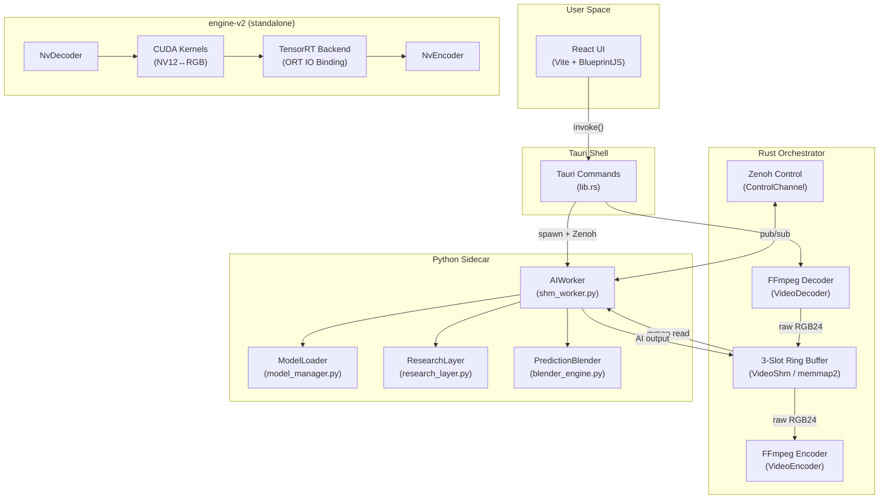

# VideoForge Architecture

## System Overview

VideoForge is a GPU-accelerated AI video super-resolution application built on a **four-layer stack**:

| Layer | Technology | Role |
|-------|-----------|------|
| **Frontend** | React 19 + Vite + BlueprintJS | Panel-based editing UI (react-mosaic) |
| **Desktop Shell** | Tauri 2.0 (Rust) | Window chrome, IPC bridge, process management |
| **Orchestrator** | Rust async (tokio) | FFmpeg decode/encode, SHM ring buffer, Zenoh control |
| **AI Worker** | Python (PyTorch + CUDA) | Super-resolution inference, research blending |

A **second-generation engine** (`engine-v2/`) exists as a standalone Rust crate implementing a fully GPU-resident pipeline (NVDEC → CUDA kernels → TensorRT → NVENC) but is **not yet integrated** into the production app.



---

## Deployment Model

- **Single-machine, single-GPU.** No multi-GPU or distributed execution.
- **Windows-only** (hardcoded `taskkill`, `CREATE_NO_WINDOW`, Windows SHM paths).
- **Python environment**: Bundled via `install_engine` command (downloads a zip containing Python + dependencies to `%APPDATA%/VideoForge/engine/`).
- **Model weights**: Stored in `weights/` directory alongside the binary. Scanned at runtime by `get_models`.

---

## Process Architecture

```
┌─────────────────────────────────────┐
│  Tauri Process (main)               │
│  ┌────────┐  ┌────────┐  ┌───────┐ │
│  │Decoder │  │ Poller │  │Encoder│ │  ← 3 tokio tasks
│  │ Task   │  │  Task  │  │ Task  │ │
│  └───┬────┘  └───┬────┘  └───┬───┘ │
│      │           │           │      │
│      └─────┬─────┘───────────┘      │
│            │ (VideoShm mmap)        │
└────────────┼────────────────────────┘
             │
    ┌────────┴────────┐
    │ Python Process   │
    │ (shm_worker.py)  │
    │ ┌──────────────┐ │
    │ │ _frame_loop  │ │  ← daemon thread polling SHM
    │ │  (batched)   │ │
    │ └──────────────┘ │
    │ ┌──────────────┐ │
    │ │ Zenoh Sub    │ │  ← command listener
    │ └──────────────┘ │
    │ ┌──────────────┐ │
    │ │  Watchdog    │ │  ← parent PID monitor
    │ └──────────────┘ │
    └──────────────────┘
```

### Process Lifecycle

1. **Spawn**: `upscale_request` resolves the Python env path, spawns `shm_worker.py` with `--port`, `--parent-pid`, `--precision` args.
2. **Handshake**: Rust sends `{"command": "ping"}` via Zenoh; Python replies `{"status": "ready"}`.
3. **Model Load**: Rust sends `load_model`; Python responds with model info and scale.
4. **SHM Create**: Rust tells Python to `create_shm` with dimensions; Python mmaps the file.
5. **Frame Loop Start**: Rust tells Python to `start_frame_loop`; Python begins polling SHM slots.
6. **Processing**: Decoder→SHM→AI→SHM→Encoder runs concurrently.
7. **Shutdown**: Rust sends `shutdown`; Python exits. `ProcessGuard` RAII ensures cleanup on drop.

---

## Key Architectural Decisions

### 1. Zero-Copy Frame Transfer via Shared Memory

Frames are passed between Rust and Python through a memory-mapped file (`memmap2` on Rust, `mmap` on Python). This avoids serialization overhead entirely for the hot path.

The ring buffer has **3 slots** (configurable), each containing an input frame buffer (`W×H×3` bytes, RGB24) and an output frame buffer (`sW×sH×3` bytes). Slot states are managed via atomic `u32` values in the header:

```
SLOT_EMPTY(0) → RUST_WRITING(1) → READY_FOR_AI(2) → AI_PROCESSING(3) → READY_FOR_ENCODE(4) → ENCODING(5) → SLOT_EMPTY(0)
```

### 2. Zenoh for Control Plane

Zenoh provides lightweight, brokerless pub/sub for:

- Command dispatch (load model, create SHM, start/stop frame loop)
- Research parameter updates (blend control, model toggling)
- Spatial map publishing (hallucination masks for overlay)

Topic structure: `videoforge/ipc/{port}/req` (Rust→Python), `videoforge/ipc/{port}/res` (Python→Rust).

### 3. Dual Engine Strategy

| | Production Pipeline | engine-v2 |
|---|---|---|
| **Decode** | FFmpeg CLI (`rawvideo` pipe) | NVDEC (CUVID API, GPU-resident) |
| **Preprocess** | Python (numpy/torch) | CUDA kernels (NV12→RGB NCHW) |
| **Inference** | PyTorch (CUDA) | TensorRT via ORT IO Binding |
| **Encode** | FFmpeg CLI (h264_nvenc) | NVENC (direct GPU encode) |
| **Frame transfer** | CPU shared memory | Zero-copy device pointers |
| **Status** | ✅ Production | 🔬 Standalone, not integrated |

### 4. Deterministic Inference

The system enforces deterministic output via:

- `torch.backends.cudnn.deterministic = True`
- `torch.backends.cudnn.benchmark = False`
- `torch.manual_seed(0)` + `np.random.seed(0)`
- `MAX_BATCH_SIZE = 1` in deterministic precision mode
- Same inference path for both image and video

### 5. Architecture Adapter Pattern

All SR models are wrapped in a `BaseAdapter` subclass (`EDSRRCANAdapter`, `TransformerAdapter`, `DiffusionAdapter`, etc.) that normalizes:

- Input range conversion ([0,1] ↔ [0,255])
- Mean subtraction (DIV2K stats)
- Window padding (for transformers)
- Output clamping and cropping

This decouples model-specific preprocessing from the unified `inference()` function.

---

## Technology Choices

| Concern | Choice | Rationale |
|---------|--------|-----------|
| Desktop framework | Tauri 2.0 | Small binary, native Rust backend |
| UI framework | React 19 + BlueprintJS | Rich component library for pro tools |
| Panel layout | react-mosaic | Resizable, dockable IDE-style panels |
| State management | Zustand | Minimal boilerplate, hook-based |
| IPC (data plane) | memmap2 + mmap | Zero-copy frame transfer |
| IPC (control plane) | Zenoh | Brokerless pub/sub, low latency |
| Video decode/encode | FFmpeg CLI | Broad codec support, NVDEC/NVENC |
| AI framework | PyTorch + CUDA | Model ecosystem, spandrel for 30+ arch |
| Model registry | spandrel | Auto-detect architecture from state dict |
| Next-gen inference | TensorRT via ORT | Maximum GPU throughput |
| GPU compute | cudarc + NVRTC | Safe Rust CUDA bindings |
| Error handling | anyhow + thiserror | Contextual errors (app) + typed errors (engine) |
| Async runtime | tokio | Industry-standard async Rust |
