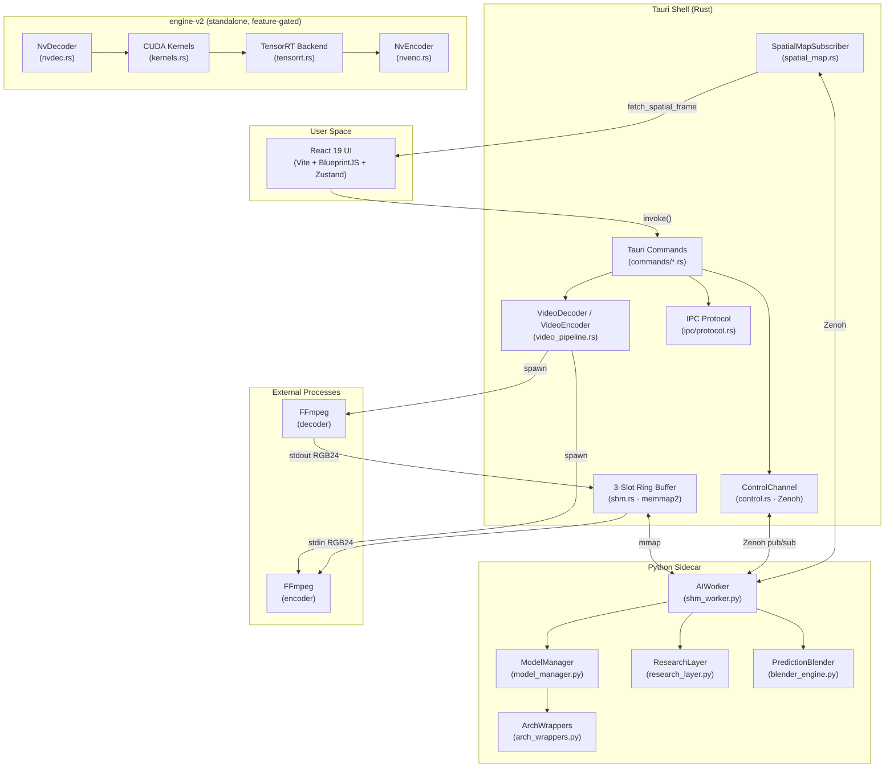

# VideoForge — Architecture & Operational Guide

> **Audience:** New contributors who need to understand, run, debug, and extend the system.
>
> **As-of date:** 2026-02-21 — based on a full read-only audit of the repository at `VideoForge1/`.

---

## 1. Executive Summary

### What It Does

VideoForge is a **local-first, GPU-accelerated desktop application** for AI-powered image and video super-resolution. Users import a video (or image), select an AI model (RCAN, EDSR, RealESRGAN, SwinIR, HAT, etc.), optionally trim/crop/color-grade, and export a higher-resolution version — all processed locally on their NVIDIA GPU.

### Who It's For

- **Professional video editors/VFX artists** who need controllable, deterministic upscaling without cloud upload.
- **Content creators** doing batch 4K upscaling of archival footage.
- **Researchers** exploring multi-model blending, hallucination detection, and frequency-domain analysis via the "Research Layer."

### Non-Goals

- **Not a cloud service.** No multi-user, no network APIs, no telemetry.
- **Not cross-platform (yet).** Windows-only with NVIDIA GPU requirement. Linux/macOS stubs exist but are non-functional.
- **Not a general video editor.** Trim/crop/color are preprocessing utilities, not a full NLE.
- **Not real-time.** Processing is offline batch; no live preview during upscaling.

---

## 2. System Diagram



### Boundary Summary

| Boundary | Mechanism | Format |
|----------|-----------|--------|
| UI ↔ Rust | Tauri `invoke()` / `listen()` | JSON (typed args/return) |
| Rust ↔ Python (control) | Zenoh pub/sub | JSON envelopes (`ipc/protocol.rs`) |
| Rust ↔ Python (data) | Memory-mapped file | Raw RGB24 bytes + atomic `u32` states |
| Rust ↔ FFmpeg | stdio pipes | Raw `rawvideo` byte stream |
| engine-v2 stages | `tokio::mpsc` channels | Rust types (`FrameEnvelope`, `GpuTexture`) |

---

## 3. Module Map

### 3.1 Rust Backend (`src-tauri/src/`)

| Module | Lines | Responsibility | Key Public APIs |
|--------|-------|---------------|-----------------|
| [lib.rs](file:///c:/Users/Calvin/Desktop/VideoForge1/src-tauri/src/lib.rs) | ~108 | Entry point, module wiring, system monitor | `run()`, `spawn_system_monitor()` |
| [commands/upscale.rs](file:///c:/Users/Calvin/Desktop/VideoForge1/src-tauri/src/commands/upscale.rs) | ~711 | AI upscale pipeline orchestration | `upscale_request()`, `run_upscale_job()` |
| [commands/native_engine.rs](file:///c:/Users/Calvin/Desktop/VideoForge1/src-tauri/src/commands/native_engine.rs) | ~598 | engine-v2 integration (feature-gated) | `upscale_request_native()`, `run_native_pipeline()` |
| [commands/export.rs](file:///c:/Users/Calvin/Desktop/VideoForge1/src-tauri/src/commands/export.rs) | ~250 | Transcode-only export (no AI) | `export_request()` |
| [commands/engine.rs](file:///c:/Users/Calvin/Desktop/VideoForge1/src-tauri/src/commands/engine.rs) | ~158 | Engine install, reset, model listing, OS helpers | `install_engine()`, `reset_engine()`, `get_models()`, `show_in_folder()` |
| [video_pipeline.rs](file:///c:/Users/Calvin/Desktop/VideoForge1/src-tauri/src/video_pipeline.rs) | ~628 | FFmpeg decode/encode subprocess management | `VideoDecoder::new()`, `VideoEncoder::new()`, `probe_video()`, `probe_nvdec()`, `probe_nvenc()` |
| [shm.rs](file:///c:/Users/Calvin/Desktop/VideoForge1/src-tauri/src/shm.rs) | ~368 | Shared memory ring buffer with atomic states | `VideoShm::open()`, `slot_state()`, `cas_slot_state()`, `input_slot_mut()`, `output_slot()` |
| [control.rs](file:///c:/Users/Calvin/Desktop/VideoForge1/src-tauri/src/control.rs) | ~551 | Zenoh control channel + research config | `ControlChannel::start()`, `get_research_config()`, `update_research_param()` |
| [ipc/protocol.rs](file:///c:/Users/Calvin/Desktop/VideoForge1/src-tauri/src/ipc/protocol.rs) | ~251 | Typed Zenoh message envelopes | `RequestEnvelope`, `ResponseEnvelope`, `IpcError` |
| [edit_config.rs](file:///c:/Users/Calvin/Desktop/VideoForge1/src-tauri/src/edit_config.rs) | ~306 | Edit parameters + FFmpeg filter chain | `EditConfig`, `FilterChainBuilder`, `calculate_output_dimensions()` |
| [models.rs](file:///c:/Users/Calvin/Desktop/VideoForge1/src-tauri/src/models.rs) | ~177 | Model weight file discovery | `ModelInfo`, `list_models()` |
| [python_env.rs](file:///c:/Users/Calvin/Desktop/VideoForge1/src-tauri/src/python_env.rs) | ~est. 100 | Python env resolution, process lifecycle | `resolve_python_environment()`, `get_python_install_dir()`, `ProcessGuard`, `PYTHON_PIDS` |
| [spatial_map.rs](file:///c:/Users/Calvin/Desktop/VideoForge1/src-tauri/src/spatial_map.rs) | ~160 | Spatial map Zenoh subscriber → UI | `SpatialMapSubscriber`, `fetch_spatial_frame()` |
| [spatial_publisher.rs](file:///c:/Users/Calvin/Desktop/VideoForge1/src-tauri/src/spatial_publisher.rs) | ~136 | Spatial map Rust → Zenoh publisher | `SpatialMapPublisher` |
| [utils.rs](file:///c:/Users/Calvin/Desktop/VideoForge1/src-tauri/src/utils.rs) | ~177 | PNG reading, base64, path generation | `read_png_frame()`, `generate_unique_path()` |

### 3.2 engine-v2 (`engine-v2/src/`)

| Module | Lines | Responsibility | Key Types |
|--------|-------|---------------|-----------|
| [pipeline.rs](file:///c:/Users/Calvin/Desktop/VideoForge1/engine-v2/src/engine/pipeline.rs) | ~1160 | 4-stage GPU pipeline orchestrator | `UpscalePipeline`, `PipelineMetrics`, `PipelineConfig`, `FrameDecoder`/`FrameEncoder` traits |
| [context.rs](file:///c:/Users/Calvin/Desktop/VideoForge1/engine-v2/src/core/context.rs) | ~858 | CUDA context, VRAM pool, buffer bucketing | `GpuContext`, `VramAccounting`, `PerfStage` |
| [kernels.rs](file:///c:/Users/Calvin/Desktop/VideoForge1/engine-v2/src/core/kernels.rs) | ~868 | CUDA preprocessing (NVRTC-compiled) | `PreprocessKernels`, `PreprocessPipeline`, `ModelPrecision` |
| [tensorrt.rs](file:///c:/Users/Calvin/Desktop/VideoForge1/engine-v2/src/backends/tensorrt.rs) | ~828 | TensorRT via ORT IO Binding | `TensorRtBackend`, `OutputRing`, `PrecisionPolicy` |
| [nvdec.rs](file:///c:/Users/Calvin/Desktop/VideoForge1/engine-v2/src/codecs/nvdec.rs) | ~629 | Hardware video decoder (CUVID API) | `NvDecoder`, `EventPool`, `BitstreamSource` trait |
| [nvenc.rs](file:///c:/Users/Calvin/Desktop/VideoForge1/engine-v2/src/codecs/nvenc.rs) | ~515 | Hardware video encoder | `NvEncoder`, `RegistrationCache`, `BitstreamSink` trait |
| [types.rs](file:///c:/Users/Calvin/Desktop/VideoForge1/engine-v2/src/core/types.rs) | ~216 | GPU frame types | `GpuTexture`, `FrameEnvelope`, `PixelFormat` |
| [backend.rs](file:///c:/Users/Calvin/Desktop/VideoForge1/engine-v2/src/core/backend.rs) | ~106 | Backend trait contract | `UpscaleBackend`, `ModelMetadata` |
| [inference.rs](file:///c:/Users/Calvin/Desktop/VideoForge1/engine-v2/src/engine/inference.rs) | ~165 | Per-frame inference pipeline | `InferencePipeline` |
| [error.rs](file:///c:/Users/Calvin/Desktop/VideoForge1/engine-v2/src/error.rs) | ~128 | Typed error hierarchy | `EngineError`, `Result` |

### 3.3 Python Worker (`python/`)

| Module | Lines | Responsibility | Key Classes/Functions |
|--------|-------|---------------|----------------------|
| [shm_worker.py](file:///c:/Users/Calvin/Desktop/VideoForge1/python/shm_worker.py) | ~1627 | Main entry, SHM frame loop, inference, Zenoh | `AIWorker`, `inference()`, `inference_batch()`, `Config`, `configure_precision()` |
| [model_manager.py](file:///c:/Users/Calvin/Desktop/VideoForge1/python/model_manager.py) | ~1670 | Model registry, weight loading, VRAM control | `_load_module()`, `_detect_family()`, `_resolve_weight_path()`, `RCAN`, `EDSR`, `ModelLoader` |
| [arch_wrappers.py](file:///c:/Users/Calvin/Desktop/VideoForge1/python/arch_wrappers.py) | ~393 | Architecture adapter pattern | `BaseAdapter`, `EDSRRCANAdapter`, `TransformerAdapter`, `DiffusionAdapter`, `create_adapter()` |
| [research_layer.py](file:///c:/Users/Calvin/Desktop/VideoForge1/python/research_layer.py) | ~1361 | HF analysis, hallucination detection, spatial blending | `HFAnalyzer`, `HallucinationDetector`, `BlendParameters` |
| [blender_engine.py](file:///c:/Users/Calvin/Desktop/VideoForge1/python/blender_engine.py) | ~567 | GPU tensor blending, temporal EMA | `PredictionBlender`, `_apply_temporal()`, `clear_temporal_buffers()` |
| [auto_grade_analysis.py](file:///c:/Users/Calvin/Desktop/VideoForge1/python/auto_grade_analysis.py) | — | Auto color grading analysis | — |
| [sr_settings_node.py](file:///c:/Users/Calvin/Desktop/VideoForge1/python/sr_settings_node.py) | — | Research settings node definitions | — |

### 3.4 UI (`ui/src/`)

| Component | Responsibility |
|-----------|---------------|
| `App.tsx` | Root shell, mosaic layout (react-mosaic), keyboard shortcuts, job dispatch |
| `Store/useJobStore.tsx` | Zustand store: `UpscaleConfig`, processing state, progress, stats |
| `Store/viewLayoutStore.ts` | Panel visibility state |
| `components/InputOutputPanel.tsx` | File picker, model selector, edit controls, research params |
| `components/PreviewPanel.tsx` | A/B comparison, crop overlay, spatial map overlay |
| `components/JobsPanel.tsx` | Job queue with progress, cancel, dismiss |
| `components/AIUpscaleNode.tsx` | Model architecture selector, scale factor |
| `components/VideoPlayer.tsx` | Video playback component |
| `components/Timeline.tsx` | Trim timeline / scrubbing |
| `components/CropOverlay.tsx` | Interactive crop region editor |
| `components/SpatialMapOverlay.tsx` | Hallucination mask canvas overlay |
| `components/StatusFooter.tsx` | GPU status, CPU/RAM stats, kill switch |
| `components/VideoEngine.tsx` | Engine install UI |
| `hooks/useTauriEvents.ts` | Tauri event listener hook |
| `utils/modelClassification.ts` | Model family detection utilities |

---

## 4. Runtime Model

### 4.1 Process Architecture

```
┌───────────────────────────────────────────────────┐
│  Tauri Process (main)                               │
│    ┌──────────────────────────────────────────┐     │
│    │ Tokio runtime (multi-threaded)            │     │
│    │  ├─ System monitor task (2s interval)     │     │
│    │  ├─ Upscale job task (per job):            │     │
│    │  │   ├─ Decoder task (FFmpeg → SHM)        │     │
│    │  │   ├─ Poller task (SHM state monitor)    │     │
│    │  │   └─ Encoder task (SHM → FFmpeg)        │     │
│    │  ├─ Zenoh control listener task            │     │
│    │  └─ Spatial map subscriber task            │     │
│    └──────────────────────────────────────────┘     │
└─────────────────┬─────────────────────────────────┘
                  │ SHM (mmap) + Zenoh pub/sub
    ┌─────────────┴─────────────────┐
    │ Python Process (shm_worker.py)  │
    │  ├─ Main thread (Zenoh loop)    │
    │  ├─ Frame loop thread (daemon)  │
    │  └─ Watchdog thread (daemon)    │
    └─────────────────────────────────┘
```

### 4.2 Lifecycle

| Phase | Rust Side | Python Side |
|-------|-----------|-------------|
| **1. Startup** | `lib::run()` → Tauri builder, tracing init, system monitor spawn | — |
| **2. Job dispatch** | `upscale_request()` → resolves Python env, opens Zenoh session | — |
| **3. Worker spawn** | Spawns `shm_worker.py` with `--port`, `--parent-pid`, `--precision` | `AIWorker.__init__()` |
| **4. Handshake** | Zenoh `ping` → waits for `ready` | Zenoh subscriber → replies `ready` |
| **5. Model load** | Zenoh `load_model` | `AIWorker.load_model()` → `model_manager._load_module()` |
| **6. SHM create** | Zenoh `create_shm` with dimensions | Python creates mmap file → Rust opens via `VideoShm::open()` |
| **7. Frame loop** | Decoder/Poller/Encoder tasks start | `_frame_loop` daemon thread starts polling |
| **8. Processing** | Concurrent decode→SHM→poll→encode | Poll SHM → inference → write SHM |
| **9. Shutdown** | Zenoh `shutdown` → `ProcessGuard` drop | Exits cleanly; watchdog kills if orphaned |

### 4.3 Initialization Order

1. `tracing_subscriber` initialized with `RUST_LOG` env var (default: `videoforge=info`)
2. Tauri builder with plugins: `dialog`, `fs`
3. Managed state: `Arc<Mutex<ResearchConfig>>`, `Arc<SpatialMapState>`
4. System monitor background task (sysinfo — CPU, RAM, GPU name)
5. 16 Tauri commands registered via `generate_handler!`

### 4.4 Shutdown

- **Normal:** `run_upscale_job()` sends Zenoh `shutdown` → Python exits → SHM file cleaned up → `ProcessGuard` drop runs
- **Panic button:** `reset_engine()` → `taskkill /F /PID` for all tracked Python PIDs (Windows-specific)
- **Orphan protection:** Python watchdog thread monitors parent PID via `kernel32.OpenProcess` — calls `os._exit(1)` if parent dies
- **`ProcessGuard` RAII:** Ensures tracked PIDs are killed when the guard is dropped, preventing zombie processes

### 4.5 Background Jobs & Scheduling

- **System monitor:** `tokio::spawn` — emits `system-stats` event every 2 seconds
- **FFmpeg probes:** `probe_nvdec()` and `probe_nvenc()` — run once, cached via `OnceLock<bool>`
- **Engine installer:** `install_engine()` — downloads ZIP, extracts, emits `install-progress` events
- **No job queue in Rust:** Jobs run sequentially; the UI-side Zustand store manages queue state

---

## 5. Critical Flows

### Flow 1: Video AI Upscale (Primary Path)

```
UI: invoke("upscale_request", {input, output, model, edit_config, scale, precision})
  │
  ▼
commands/upscale.rs: upscale_request()
  ├─ Builds UpscaleJobConfig
  ├─ Emits progress via closure → app.emit("upscale-progress", JobProgress)
  └─ Calls run_upscale_job(config, progress_fn)
     │
     ├─ 1. resolve_python_environment()  →  python.exe path
     ├─ 2. probe_video(input)  →  (W, H, duration, fps, total_frames)
     ├─ 3. calculate_output_dimensions(edit_config, W, H)  →  (out_w, out_h)
     ├─ 4. build_ffmpeg_filters(edit_config, W, H)  →  filter_str
     ├─ 5. Zenoh session  →  publisher on "videoforge/ipc/{port}/req"
     ├─ 6. Spawn shm_worker.py  →  ProcessGuard (RAII)
     ├─ 7. Zenoh handshake: ping → ready
     ├─ 8. Zenoh: load_model → model_loaded (returns scale)
     ├─ 9. Zenoh: create_shm → shm_created (Python creates file)
     ├─ 10. VideoShm::open(path, out_w, out_h, scale)  →  validates header
     ├─ 11. Spawn ControlChannel::start() for research params
     ├─ 12. Zenoh: start_frame_loop
     │
     ├─ 13. CONCURRENT TASKS:
     │   ├─ Decoder task: VideoDecoder::new() → loop read_raw_frame_into() → SHM input slot
     │   ├─ Poller task: monitor slot states, push research config updates
     │   └─ Encoder task: read SHM output slot → VideoEncoder::write_raw_frame()
     │
     ├─ 14. All frames processed → Zenoh: shutdown
     └─ 15. VideoEncoder::finish() → FFmpeg finalizes MP4
```

**Call path:** `App.tsx` → `useJobStore.setUpscaleConfig()` → `invoke("upscale_request")` → `commands/upscale.rs::upscale_request()` → `run_upscale_job()` → `video_pipeline.rs::VideoDecoder/VideoEncoder` + `shm.rs::VideoShm` + `python/shm_worker.py::AIWorker._frame_loop()`

### Flow 2: Export Without AI

```
UI: invoke("export_request", {input, output, edit_config})
  │
  ▼
commands/export.rs: export_request()
  ├─ probe_video(input)
  ├─ build_ffmpeg_filters(edit_config)
  ├─ Spawn single FFmpeg process: ffmpeg -i input [filters] -c:v h264_nvenc output.mp4
  └─ Stream progress via stderr parsing
```

No Python worker, no SHM. Direct FFmpeg transcode with geometry/color filters.

### Flow 3: Image Upscale

```
Rust → Zenoh: {"command": "upscale_image_file", "input_path": ..., "output_path": ..., "edit_config": ...}
Python:
  ├─ Load image → apply edit transforms
  ├─ inference(model, img_rgb, device, half, adapter)
  ├─ Save result to output_path
  └─ Zenoh reply: {"status": "complete", "output_path": ...}
```

No SHM ring buffer. Single image processed in-memory.

### Flow 4: Research Parameter Update (Real-time)

```
UI slider change
  → invoke("update_research_param", {key: "blend_alpha", value: 0.7})
  → control.rs: update_research_param()
  → Arc<Mutex<ResearchConfig>> updated
  → Zenoh pub on "vf/control/params" → forwarded to Python IPC topic
  → Python: AIWorker receives → updates BlendParameters
  → Next frame uses new parameters
```

### Flow 5: Native Engine (engine-v2, feature-gated)

```
UI: invoke("upscale_request_native", {input, output, model_path, scale, precision})
  │
  ▼
commands/native_engine.rs: upscale_request_native()
  ├─ FFmpeg demux: extract elementary H.264/HEVC stream (Annex B)
  ├─ run_engine_pipeline():
  │   ├─ GpuContext::new() → CUDA context + VRAM pool
  │   ├─ PreprocessKernels::compile() → NVRTC kernels
  │   ├─ TensorRtBackend::new() → ORT session with TensorRT EP
  │   ├─ NvDecoder::new() + FileBitstreamSource
  │   ├─ NvEncoder::new() + FileBitstreamSink
  │   └─ UpscalePipeline::run(decoder, backend, encoder)
  │       ├─ Decode stage: NvDecoder.decode_next() → FrameEnvelope
  │       ├─ Preprocess stage: PreprocessPipeline.prepare() → ModelInput
  │       ├─ Infer stage: TensorRtBackend.process() → GpuTexture
  │       └─ Encode stage: NvEncoder.encode_frame() → bitstream
  └─ FFmpeg remux: mux video + optional audio → MP4
```

---

## 6. Data Model

### 6.1 Persisted State

> [!IMPORTANT]
> VideoForge stores **no database**. All state is ephemeral or file-based.

| Data | Location | Format | Lifetime |
|------|----------|--------|----------|
| Model weights | `weights/*.pth`, `.pt`, `.safetensors` | PyTorch state dicts / safetensors | Permanent, user-managed |
| Python runtime | `%APPDATA%/Local/VideoForge/python/` | Bundled Python + pip packages | Installed once via `install_engine` |
| SHM ring buffer | Temp file (Windows named mmap or `/dev/shm/`) | Binary: global header + slot headers + raw RGB24 | Per-job, deleted on cleanup |
| Upscale config | Zustand in-memory store (`useJobStore.tsx`) | JS object | Per-session, lost on close |
| Research config | `Arc<Mutex<ResearchConfig>>` in Rust | Rust struct | Per-session |
| Video outputs | User-specified output path | MP4 (H.264/H.265 via FFmpeg) | Permanent |

### 6.2 SHM Binary Layout

```
Offset 0:     Global Header (36 bytes)
              ┌──────────────────────────────────────────────┐
              │ magic:     [u8; 8]   "VFSHM\0\0\0"          │
              │ version:   u32       currently 1              │
              │ hdr_size:  u32       36 (for validation)      │
              │ slot_cnt:  u32       RING_SIZE (6)             │
              │ width:     u32                                 │
              │ height:    u32                                 │
              │ scale:     u32                                 │
              │ pix_fmt:   u32       0 = RGB24                 │
              └──────────────────────────────────────────────┘

Offset 36:    Slot Headers (RING_SIZE × 16 bytes)
              ┌──────────────────────────────────────────────┐
              │ state:       u32 (atomic)  slot FSM value     │
              │ frame_bytes: u32           actual data length  │
              │ write_index: u32           frame counter       │
              │ reserved:    u32                               │
              └──────────────────────────────────────────────┘

Offset 36 + (RING_SIZE × 16):   Data Regions
              ┌──────────────────────────────────────────────┐
              │ Slot 0 Input:  W × H × 3 bytes (RGB24)       │
              │ Slot 0 Output: (W×scale) × (H×scale) × 3     │
              │ Slot 1 Input + Output...                      │
              │ ...                                           │
              └──────────────────────────────────────────────┘
```

SHM constants are generated at build time by `src-tauri/build.rs` from a shared `ipc/shm_protocol.json`, then `include!`-ed into `shm.rs`. Python loads the same JSON via `Config.load_shm_protocol()`.

### 6.3 Slot State Machine

```
EMPTY(0) → RUST_WRITING(1) → READY_FOR_AI(2) → AI_PROCESSING(3) → READY_FOR_ENCODE(4) → ENCODING(5) → EMPTY(0)
```

Transitions use `AtomicU32` with `Ordering::SeqCst` for cross-process visibility.

### 6.4 Serialization Formats

| Boundary | Format | Schema |
|----------|--------|--------|
| Tauri IPC | JSON | TypeScript types ↔ `serde` structs |
| Zenoh control | JSON envelopes | `RequestEnvelope` / `ResponseEnvelope` in `ipc/protocol.rs` |
| SHM data | Raw bytes | Binary RGB24 pixel data |
| Spatial map | Binary | `[u32:W][u32:H][u8×W×H:mask]` |
| Model weights | PyTorch `.pth`/`.pt` or safetensors | State dicts with architecture-specific keys |

---

## 7. External Dependencies

### 7.1 Runtime Dependencies

| Dependency | Type | Version | What Breaks If Missing |
|-----------|------|---------|----------------------|
| **FFmpeg** | CLI subprocess | Any recent | Video decode/encode fails entirely — `No such file or directory` error. Encoder fallback to libx264 if NVENC unavailable. |
| **FFprobe** | CLI subprocess | (bundled with FFmpeg) | `probe_video()` fails → cannot determine video dimensions/duration |
| **NVIDIA GPU Driver** | System | R525+ for CUDA 12 | CUDA operations fail; `torch.cuda.is_available()` returns false |
| **CUDA Toolkit** | System for engine-v2 | 11.7+ (prod), 12.6 (engine-v2) | Python pipeline uses PyTorch bundled CUDA; engine-v2 needs system CUDA |
| **Python** | Bundled/local | 3.10+ | AI inference unavailable; upscale_request fails at spawn |
| **PyTorch** | pip | 2.0.1+cu117 | Model loading/inference fails |
| **spandrel** | pip | Latest | Auto-detection of 30+ model architectures fails; falls back to legacy RCAN/EDSR builders |
| **basicsr + realesrgan** | pip | Latest | RealESRGAN models fail to load |
| **zenoh** | Rust crate | 1.0.2 | All Rust ↔ Python communication fails |
| **Zenoh (Python)** | pip (via eclipse-zenoh) | Compatible | Python-side IPC fails |
| **ONNX Runtime** | Rust crate (ort) | =2.0.0-rc.11 | engine-v2 TensorRT inference fails |
| **cudarc** | Rust crate | 0.12 | engine-v2 CUDA kernel compilation/launch fails |

### 7.2 Build Dependencies

| Dependency | Purpose |
|-----------|---------|
| Node.js ≥ 18 | Vite dev server, Tauri CLI |
| Rust stable toolchain | Tauri backend + engine-v2 compilation |
| `@tauri-apps/cli` ^2.1.0 | `npm run dev` / `npm run build` |
| React 19 + Vite 6 | Frontend build |
| BlueprintJS 6 | UI component library |

### 7.3 Failure Modes

| Failure | Impact | Detection |
|---------|--------|-----------|
| FFmpeg not in PATH | All video operations fail | `VideoDecoder::new()` returns error |
| NVDEC unavailable | Falls back to CPU decode (slower) | `probe_nvdec()` returns false, logged |
| NVENC unavailable | Falls back to libx264 CPU encode | `probe_nvenc()` returns false, logged |
| Python env missing | AI upscaling unavailable | `check_engine_status()` returns false |
| Model weight file missing | Specific model fails to load | `_resolve_weight_path()` raises `FileNotFoundError` |
| Zenoh session failure | Rust ↔ Python control plane down | Handshake timeout |
| VRAM exhaustion | Model load or inference OOM | PyTorch RuntimeError; engine-v2 `EngineError::Cuda` |

---

## 8. Configuration

### 8.1 Environment Variables

| Variable | Default | Scope | Purpose |
|----------|---------|-------|---------|
| `RUST_LOG` | `videoforge=info` | Rust | `tracing_subscriber` filter (e.g., `videoforge=debug,zenoh=warn`) |
| `PATH` | System | All | Must include `ffmpeg` and `ffprobe` |
| `CUDA_VISIBLE_DEVICES` | All GPUs | Python/CUDA | GPU selection |

### 8.2 Config Files

| File | Format | Purpose |
|------|--------|---------|
| `tauri.conf.json` | JSON | Window size (1280×720), CSP policy (null = disabled), asset protocol scope, bundle config |
| `src-tauri/Cargo.toml` | TOML | Feature flags: `native_engine` (default on). Dependency versions. |
| `engine-v2/Cargo.toml` | TOML | CUDA/ORT/tokio versions. `debug-alloc` feature for allocation tracking. |
| `ipc/shm_protocol.json` | JSON | SHM constants shared between Rust (build.rs) and Python |
| `requirements.txt` | pip | Python dependencies with pinned PyTorch versions |
| `ui/vite.config.ts` | TypeScript | Vite bundler config, dev server port (5173) |

### 8.3 Compile-time Configuration

| Setting | Location | Default |
|---------|----------|---------|
| `native_engine` feature | `src-tauri/Cargo.toml` | Enabled (default) |
| `debug-alloc` feature | `engine-v2/Cargo.toml` | Disabled |
| Frontend dev URL | `tauri.conf.json` | `http://localhost:5173` |
| Window decorations | `tauri.conf.json` | `false` (custom title bar) |
| Asset protocol scope | `tauri.conf.json` | `["**"]` (all paths) |

### 8.4 Runtime Constants

| Constant | Value | Location |
|----------|-------|----------|
| `RING_SIZE` | 6 | `python/shm_worker.py::Config` (loaded from `shm_protocol.json`) |
| `TILE_SIZE` | 512 | `python/shm_worker.py::Config` |
| `TILE_PAD` | 32 | `python/shm_worker.py::Config` |
| `MAX_BATCH_SIZE` | 3 (1 in deterministic mode) | `python/shm_worker.py::Config` |
| `PARENT_CHECK_INTERVAL` | 2 seconds | `python/shm_worker.py::Config` |
| `CRF` | 18 | `video_pipeline.rs::VideoEncoder` |
| System monitor interval | 2 seconds | `lib.rs::spawn_system_monitor` |
| `PROTOCOL_VERSION` | 1 | `ipc/protocol.rs` |

### 8.5 Precedence

No formal precedence system exists. Compile-time features override everything. Runtime constants are hardcoded; environmental configuration is limited to `RUST_LOG`.

---

## 9. Observability

### 9.1 Logging

| Layer | Mechanism | Destination | Structured? |
|-------|-----------|-------------|-------------|
| Rust backend | `tracing` crate | stdout/stderr | ✅ Yes — `tracing::info!`, `warn!`, `error!` with structured fields |
| engine-v2 | `tracing` crate | stdout/stderr | ✅ Yes — uses `tracing::info_span!` |
| Python worker | `print()` | stdout | ❌ No — bare print statements |
| FFmpeg | stderr | piped to Rust | ❌ No — raw FFmpeg output |

**To increase Rust log verbosity:**

```bash
RUST_LOG=videoforge=debug,zenoh=warn npm run dev
```

### 9.2 Metrics

| Metric | Source | How to Access |
|--------|--------|---------------|
| Upscale progress | `commands/upscale.rs` → `app.emit("upscale-progress", ...)` | UI listens via `useTauriEvents.ts` |
| System stats (CPU, RAM) | `sysinfo` crate → `app.emit("system-stats", ...)` | `StatusFooter.tsx` |
| Per-stage frame counts | engine-v2 `PipelineMetrics` | `metrics.report()` at shutdown (tracing output) |
| Per-stage latencies | engine-v2 `PipelineMetrics` | Average microseconds per stage, logged at shutdown |
| Ordering invariants | engine-v2 `PipelineMetrics::validate()` | Logged warning if `decoded < preprocessed < inferred < encoded` |

### 9.3 Where to Look When Things Break

| Symptom | Where to Look |
|---------|---------------|
| Black video output | Python `_process_slot` → check `inference()` output is not all zeros; check SHM slot state transitions |
| UI frozen, no progress | Check Zenoh handshake succeeded; check Python process is alive (`PYTHON_PIDS`) |
| NVENC invalid argument | `video_pipeline.rs::build_encoder_args` — check resolution is even and pixel format matches |
| Model load failure | Python stdout — `model_manager._load_module()` prints errors; check `weights/` directory |
| SHM validation error | `shm.rs::VideoShm::open()` — check magic, version, header_size fields match expected |
| OOM crash | Python stderr — PyTorch RuntimeError; reduce batch size or use FP16 |
| Spatial map missing | Check `SpatialMapSubscriber` is actively listening on Zenoh topic |

---

## 10. Security & Trust Boundaries

### 10.1 Authentication & Authorization

**None.** VideoForge is a single-user desktop application. No auth, no multi-tenancy.

### 10.2 Secrets

| Secret | Storage | Risk |
|--------|---------|------|
| No API keys | — | — |
| No user credentials | — | — |
| Engine download URL | Hardcoded in `commands/engine.rs` | URL `https://github.com/YourRepo/releases/...` — placeholder; if changed to a real URL, MITM possible over HTTPS |

### 10.3 Trust Boundaries

```
┌────────────────────────────────────────────────────┐
│  TRUSTED: Tauri Process (Rust)                      │
│  - Full filesystem access                           │
│  - Process spawn (Python, FFmpeg)                   │
│  - Network access (engine download only)            │
├────────────────────────────────────────────────────┤
│  SEMI-TRUSTED: Python Sidecar                       │
│  - Runs with same user privileges                   │
│  - Executes arbitrary model code (torch.load)       │
│  - Full GPU access                                  │
├────────────────────────────────────────────────────┤
│  SEMI-TRUSTED: UI (WebView2)                        │
│  - CSP is disabled (null)                           │
│  - Asset protocol scope: ["**"] (all paths)         │
│  - Can invoke() any registered Tauri command        │
└────────────────────────────────────────────────────┘
```

### 10.4 Input Validation

| Input Point | Validation | Gap |
|-------------|-----------|-----|
| Tauri `invoke()` args | Serde deserialization enforces types | No path traversal checks on input/output paths |
| `EditConfig` | `validate()` checks numeric ranges (brightness, contrast, etc.) | Rotation values validated via custom deserializer |
| SHM header | Magic number + version + header_size validated in `VideoShm::open()` | ✅ Good defense against corrupt SHM files |
| Model weight files | `torch.load()` with pickle — **arbitrary code execution risk** | ⚠️ Known PyTorch security issue; mitigated by local-only usage |
| Zenoh messages | `serde_json` deserialization; unknown fields silently ignored | No authentication on Zenoh topics |
| FFmpeg args | Constructed programmatically (not user-interpolated) | ✅ No injection risk |

### 10.5 Key Risks

> [!WARNING]
> **`torch.load()` deserializes pickle** — a malicious `.pth` file can execute arbitrary code. This is acceptable for a local app where the user provides their own models, but any model download feature must verify integrity.

> [!WARNING]
> **CSP is disabled** (`"csp": null` in `tauri.conf.json`). The WebView can load arbitrary resources. Acceptable for a local app but prevents hardening if network features are added.

> [!CAUTION]
> **Asset protocol scope `["**"]`** allows the UI to read any file on disk via the Tauri asset protocol. This is a broad permission.

---

## 11. Performance

### 11.1 Bottleneck Analysis

| Bottleneck | Severity | Location | Impact |
|-----------|----------|----------|--------|
| **CPU-mediated frame transfer** | 🔴 Critical | `shm.rs` ↔ `shm_worker.py` | 4K: ~96 MB/frame through CPU = ~2.9 GB/s wasted at 30fps |
| **FFmpeg subprocess pipes** | 🔴 Critical | `video_pipeline.rs` | 65KB pipe buffer on Windows; double GPU↔CPU transfer negates NVDEC/NVENC |
| **Python GIL + polling** | 🟡 Moderate | `shm_worker.py::_frame_loop` | `time.sleep(0.0005)` polling; GIL prevents true parallelism |
| **Per-frame tensor allocation** | 🟡 Moderate | `shm_worker.py::_process_slot` | `torch.from_numpy()`, `.float()`, `.div_(255)` allocate new CUDA tensors each frame |
| **3→6 slot ring buffer** | 🟢 Low | Config | Caps pipeline parallelism |

### 11.2 Estimated Per-Frame Latency (1080p, RCAN_x4)

| Stage | Time | Notes |
|-------|------|-------|
| FFmpeg decode | ~1-3 ms | Pipe transfer dominates |
| SHM write (Rust→mmap) | ~2-5 ms | 6 MB memcpy |
| SHM read (Python←mmap) | ~2-5 ms | 6 MB memcpy + numpy |
| Tensor creation | ~1-2 ms | GPU alloc + H2D |
| **Model inference** | **~50-200 ms** | **GPU compute (dominant)** |
| Research post-process | ~5-20 ms | HF analysis, blending |
| Torch→numpy→SHM | ~5-10 ms | D2H + memcpy |
| FFmpeg encode | ~2-5 ms | H2D + NVENC |
| **Total** | **~70-255 ms** | **~4-14 FPS** |

### 11.3 Memory Profile

| Consumer | Host Memory | GPU Memory |
|----------|-------------|------------|
| SHM mmap (6 slots, 4K×4 upscale) | ~4.2 GB | — |
| FFmpeg processes | ~200 MB-1 GB | — |
| Python process | ~200-500 MB | — |
| RCAN model (FP32) | — | ~300-500 MB |
| RealESRGAN model | — | ~100-300 MB |
| Inference workspace | — | ~500 MB-2 GB |
| Research layer tensors | — | ~100-500 MB |

### 11.4 Scaling Limits

- **Single GPU only.** No multi-GPU support.
- **Sequential jobs** — Rust has no concurrent job execution.
- **VRAM ceiling:** 8 GB consumer GPU is tight for 4K RCAN + research layer. 12 GB+ recommended.
- **Disk I/O:** Not typically a bottleneck; SSD assumed.

---

## 12. Risk Register

| # | Risk | Severity | Likelihood | Mitigation |
|---|------|----------|-----------|------------|
| R1 | **VRAM exhaustion on consumer GPUs** (8 GB) when processing 4K with research layer | High | High | engine-v2 has `set_vram_limit` advisory cap; Python should implement OOM fallback to smaller tile size |
| R2 | **engine-v2 codec gaps** — no audio passthrough, limited container format support | High | Certain (current state) | FFmpeg used for demux/remux around engine-v2 video stream in `native_engine.rs` |
| R3 | **torch.load() arbitrary code execution** from malicious model files | High | Low (local-only) | Use `safetensors` format + integrity verification for any download feature |
| R4 | **SHM protocol version skew** between Rust and Python | Medium | Medium | Shared `shm_protocol.json` with build-time codegen; SHM header validation catches mismatches |
| R5 | **Zenoh message schema drift** — implicit JSON contracts | Medium | Medium | Typed `ipc/protocol.rs` envelopes now formalized; Python side still uses raw dicts |
| R6 | **Windows-only hardcoding** prevents cross-platform expansion | Medium | Certain | `taskkill`, `CREATE_NO_WINDOW`, `ctypes.windll` — #[cfg(target_os)] guards partially in place |
| R7 | **Single-threaded Python GIL** limits frame loop throughput | Medium | Certain | Mitigated by GPU-bound workload; long-term fix is engine-v2 migration |
| R8 | **TensorRT model compatibility** — not all PyTorch operators supported by TRT | Medium | Medium | Fall back to Python pipeline for unsupported models |
| R9 | **CSP disabled + broad asset scope** — could be exploited if network features added | Low | Low | Tighten CSP and scope before adding any network-facing functionality |
| R10 | **`ort` crate pinned to RC version** (`=2.0.0-rc.11`) | Low | Medium | Monitor for stable release; RC may have bugs or API changes |
| R11 | **Orphaned Python processes** if `ProcessGuard` drop is bypassed (e.g., SIGKILL) | Medium | Low | Watchdog thread in Python monitors parent PID; `reset_engine` panic button |
| R12 | **Large lib decomposition incomplete** — some historical reference to monolithic `lib.rs` | Low | Low | Already decomposed into `commands/` module tree |

---

## 13. Action Plan — Top 10 Improvements

| # | Improvement | Effort | Impact | Safe Rollout Steps | Test Plan |
|---|------------|--------|--------|-------------------|-----------|
| **1** | **Pre-allocate CUDA tensors in Python** — reuse input/output tensors across frames instead of per-frame allocation | 🟢 Small (1-2 days) | 🟡 Moderate (1-2 ms/frame saved) | 1. Add `_input_tensor` / `_output_tensor` to `AIWorker` in `create_shm`. 2. Copy into pre-allocated buffers in `_process_slot`. 3. A/B test FPS with existing test video. | Run upscale on `test_input.mp4`, compare FPS before/after. Verify bit-exact output with deterministic mode. |
| **2** | **Replace polling sleep with named semaphores** — cross-process sync instead of `time.sleep(0.0005)` | 🟢 Small (2-3 days) | 🟡 Moderate (eliminates CPU waste, ~0.5 ms/frame latency reduction) | 1. Create Win32 named event in Rust after SHM creation. 2. Python waits on event instead of polling. 3. Feature-flag behind `--use-events` CLI arg for rollback. | Verify correct frame ordering. Stress test with rapid model switching. CPU usage should drop significantly. |
| **3** | **Formalize Python-side IPC protocol** — mirror `ipc/protocol.rs` envelopes in Python | 🟢 Small (1-2 days) | 🟡 Moderate (prevents schema drift bugs) | 1. Create `python/ipc_protocol.py` with `RequestEnvelope`/`ResponseEnvelope` dataclasses. 2. Update `shm_worker.py` to use typed envelopes. 3. Add version validation on handshake. | Unit test: serialize/deserialize roundtrip. Integration test: upscale job with version mismatch → expect clear error. |
| **4** | **Migrate Python logging from `print()` to `logging` module** | 🟢 Small (1 day) | 🟢 Low (debuggability) | 1. `import logging; log = logging.getLogger("videoforge")` in all Python modules. 2. Structured format: `%(asctime)s %(levelname)s %(name)s %(message)s`. 3. Accept `--log-level` CLI arg. | Verify log output appears with expected format. Verify `print()` statements are removed. |
| **5** | **Increase ring buffer to 6-8 slots** | 🟢 Small (1 day) | 🟡 Moderate (better pipeline overlap) | 1. Update `RING_SIZE` in `shm_protocol.json`. 2. Both sides auto-pick up via codegen/load. 3. Monitor host memory usage increase. | Profile decode/encode overlap. Verify SHM file size is correct. Stress test with 4K video. |
| **6** | **Migrate engine-v2 `ort` dependency to stable release** | 🟢 Small (1 day) | 🟡 Moderate (stability) | 1. Check crates.io for ort 2.0 stable. 2. Update `engine-v2/Cargo.toml`. 3. Run `cargo check --features native_engine`. 4. Run engine-v2 smoke tests. | `cargo test` passes. Native engine pipeline processes test video without error. |
| **7** | **Tighten CSP and asset protocol scope** | 🟢 Small (1 day) | 🟡 Moderate (security hardening) | 1. Set CSP to `"default-src 'self'; img-src 'self' asset: https://asset.localhost"`. 2. Narrow asset scope to specific directories. 3. Test all UI functionality. | All panels render. Video preview works. Spatial map overlay works. No console CSP errors. |
| **8** | **Port TensorRT model export from Python to production** | 🟡 Medium (1-2 weeks) | 🔴 High (3-5× inference speedup) | 1. Add ONNX export script for RCAN/EDSR. 2. Test exported models in engine-v2 `TensorRtBackend`. 3. Add UI option "Use optimized model". 4. Feature-flag for gradual rollout. | Compare output quality (PSNR/SSIM) between PyTorch and TRT. Verify FPS improvement. Bit-exactness not expected for TRT. |
| **9** | **Integrate engine-v2 as default pipeline** | 🔴 Large (3-6 weeks) | 🔴 High (5-10× throughput) | 1. Per `REFACTOR_OR_MIGRATION_PLAN.md` Phase 3. 2. `BitstreamSource`/`BitstreamSink` for file I/O. 3. UI toggle (already have `useNativeEngine` in store). 4. Feature-flag Python pipeline as fallback. | Full test matrix: each model × each resolution × each edit combo. Frame count match. Visual quality comparison. |
| **10** | **Add automated integration tests** | 🟡 Medium (1 week) | 🟡 Moderate (confidence) | 1. Create `tests/` directory with test videos. 2. Rust integration test: spawn full pipeline, verify output frame count. 3. Python unit tests for `inference()`, `model_manager`. 4. CI workflow in `.github/`. | Tests pass in CI. Coverage for: model load, SHM roundtrip, edit config validation, IPC protocol. |

---

## Appendix A: Build & Run Cheat Sheet

```bash
# First-time setup
npm install                    # Root package (Tauri CLI)
npm run ui-install             # UI dependencies: cd ui && npm install
pip install -r requirements.txt  # Python AI dependencies (in venv)

# Development
npm run dev                    # Tauri + Vite hot-reload (port 5173)
# or
run.bat                        # Convenience launcher (Windows)

# Production build
npm run build                  # Compiles Rust + bundles UI

# Type checking
cd ui && npx tsc --noEmit      # TypeScript type check

# Rust tests
cd src-tauri && cargo test     # Unit tests (shm, ipc protocol)

# Compile with native engine
cd src-tauri && cargo check --features native_engine

# Increase Rust log verbosity
set RUST_LOG=videoforge=debug  # Windows
npm run dev
```

## Appendix B: Tauri Command Reference

| Command | Module | Purpose |
|---------|--------|---------|
| `upscale_request` | `commands/upscale.rs` | AI video/image upscale via Python pipeline |
| `upscale_request_native` | `commands/native_engine.rs` | AI upscale via engine-v2 (feature-gated) |
| `export_request` | `commands/export.rs` | Transcode-only export (no AI) |
| `check_engine_status` | `commands/engine.rs` | Check if Python env is available |
| `install_engine` | `commands/engine.rs` | Download + install Python runtime |
| `reset_engine` | `commands/engine.rs` | Kill all Python processes (panic button) |
| `get_models` | `commands/engine.rs` | List available model weight files |
| `show_in_folder` | `commands/engine.rs` | Open Explorer at path |
| `open_media` | `commands/engine.rs` | Open file with default app |
| `get_research_config` | `control.rs` | Get current research parameter values |
| `set_research_config` | `control.rs` | Set all research parameters at once |
| `update_research_param` | `control.rs` | Update single research parameter |
| `reset_temporal_buffer` | `control.rs` | Clear temporal EMA buffers |
| `fetch_spatial_frame` | `spatial_map.rs` | Get latest hallucination mask for UI overlay |
| `mark_frame_complete` | `spatial_map.rs` | Mark spatial frame as consumed |

## Appendix C: Zenoh Topic Structure

| Topic | Direction | Payload |
|-------|-----------|---------|
| `videoforge/ipc/{port}/req` | Rust → Python | `RequestEnvelope` JSON (ping, load_model, create_shm, start_frame_loop, shutdown, etc.) |
| `videoforge/ipc/{port}/res` | Python → Rust | `ResponseEnvelope` JSON (ready, model_loaded, shm_created, progress, complete, error) |
| `vf/control/params` | Rust → Python (forwarded) | Research parameter updates |
| `vf/control/blend` | Rust → Python (forwarded) | Blend control messages |
| `vf/control/model_toggle` | Rust → Python (forwarded) | Model toggle messages |
| `videoforge/research/spatial_map` | Python → Rust | Binary spatial mask `[u32:W][u32:H][u8×W×H]` |

## Appendix D: Model Loading Resolution Order

```
1. weights/{key}.pth
2. weights/{key}.pt
3. weights/{key}.safetensors
4. weights/{key}/{key}.pth
5. Glob scan: weights/*{key}*.*
```

Loading strategy (in `model_manager._load_module()`):

1. Try `torch.load()` as full model object
2. Try `spandrel.ModelLoader` (auto-detects 30+ architectures)
3. Fallback to legacy builders (RCAN/EDSR class definitions)
4. Wrap in `create_adapter()` → `BaseAdapter` subclass

## Appendix E: Assumptions & Unknowns

| Item | Status |
|------|--------|
| Python Zenoh library version compatibility with Rust zenoh 1.0.2 | **Assumption:** compatible; not verified in requirements.txt |
| `engine.zip` download URL in `commands/engine.rs` | **Placeholder** (`https://github.com/YourRepo/releases/...`) — not a real URL |
| Audio passthrough in native engine pipeline | **Implemented** via FFmpeg remux in `native_engine.rs` but untested per conversation history |
| `shm_protocol.json` location | **Assumption:** `ipc/` directory based on `Config.load_shm_protocol()` |
| Face swap/blur features referenced in conversation history | **Not found in current codebase** — may have been removed or in a separate branch |
| GPU name in system stats | **Hardcoded** as `"NVIDIA CUDA:0"` in `spawn_system_monitor()` |
