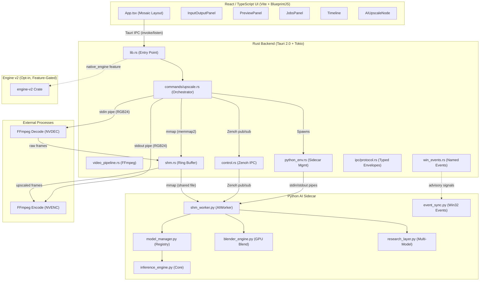

# VideoForge — Architecture & Operational Guide

> **Audience**: New contributors, staff engineers, on-call.
> **Source of truth date**: 2026-02-26.
> **Evidence standard**: every major claim references concrete file paths + key symbols.

---

## 0. Coverage

### Directories / files reviewed

| Area | Reviewed |
|------|----------|
| `src-tauri/src/` | All 14 source files + `commands/` (6) + `ipc/` (2) + `bin/` (2) |
| `python/` | All 15 modules + `tests/` (9 test files) + `architectures/`, `loaders/` |
| `engine-v2/src/` | `lib.rs`, `error.rs`, `debug_alloc.rs`, `core/` (5), `codecs/` (4), `backends/` (2), `engine/` (3) |
| `ui/src/` | `App.tsx`, `index.tsx`, `types.ts`, `components/` (19 + 2 subdirs), `Store/`, `hooks/`, `utils/` |
| Config | `Cargo.toml`, `package.json` (root + UI), `tauri.conf.json`, `pyproject.toml`, `requirements.txt`, `tsconfig.json` |
| Docs | All 12 files in `docs/`, `README.md`, `SMOKE_TEST.md` |
| Tools | `tools/smoke.ps1`, `tools/export_onnx.py`, `tools/bench/`, `tools/ci/` |
| Third-party | `third_party/` (RAVE workspace — scanned but only structurally inspected) |

### Not reviewed (and why)

| Area | Reason |
|------|--------|
| `node_modules/`, `target/` | Generated / vendored |
| `.git/` | VCS metadata |
| `weights/` | Binary model weights (not tracked) |
| `third_party/` internals | External RAVE project; only integration surface (`rave_cli.rs`, `commands/rave.rs`) reviewed |
| `artifacts/` | CI/build outputs |

---

## 1. Executive Summary

### What it does

VideoForge is a **local-first, GPU-accelerated desktop application** for AI-powered image and video super-resolution. It decodes video with FFmpeg, upscales every frame through PyTorch neural networks on the user's NVIDIA GPU, and re-encodes the result via NVENC — all without any cloud or network calls.

### Who it's for

- **Professional video editors** who need deterministic, high-quality upscaling.
- **AI researchers** who want to experiment with blending multiple SR models (via the research layer).

### Non-goals

- Cloud/SaaS deployment — the app is strictly local and single-machine.
- Mobile or Linux platform support — Windows 10/11 only today.
- Real-time playback — the pipeline targets offline batch processing (though preview is supported).

---

## 2. Quickstart

### Prerequisites

| Requirement | Version | Notes |
|-------------|---------|-------|
| **OS** | Windows 10/11 | Primary and only supported platform |
| **GPU** | NVIDIA with CUDA 11.7+ | NVENC support required for HW encode |
| **Node.js** | ≥ 18 | For UI and Tauri CLI |
| **Rust** | Stable toolchain | For backend compilation |
| **FFmpeg + FFprobe** | Any recent | Must be on `PATH` |
| **Python** | 3.10+ | For AI sidecar; can be bundled or local venv |

### Setup

```powershell
# 1. Clone
git clone <repo-url>
cd VideoForge

# 2. Install root Tauri CLI
npm install

# 3. Install UI dependencies
npm run ui-install

# 4. Install Python AI deps (in your venv)
pip install -r requirements.txt
# Or from pyproject.toml:
pip install -e "./python[dev]" --extra-index-url https://download.pytorch.org/whl/cu117
```

### Build / Run / Test

| Command | Description |
|---------|-------------|
| `npm run dev` | Launch Tauri + Vite dev server (hot-reload) |
| `npm run build` | Production build (Rust compile + UI bundle) |
| `run.bat` | One-click dev launcher |
| `cd src-tauri && cargo test` | Run Rust unit tests |
| `cd ui && npx tsc --noEmit` | TypeScript type-check |
| `cd python && python -m pytest tests/` | Run Python unit tests |
| `cargo run --manifest-path src-tauri/Cargo.toml --bin smoke -- --model RCAN_x4` | Smoke test (see `SMOKE_TEST.md`) |

### Common dev loop

1. `npm run dev` → opens Tauri window with hot-reloading UI.
2. Edit React components in `ui/src/` → auto-reloads.
3. Edit Rust in `src-tauri/src/` → Tauri recompiles automatically.
4. Edit Python in `python/` → restart the upscale job (Python is spawned per-job).

---

## 3. System Diagram



### Process boundaries

| Process | Role | Lifetime |
|---------|------|----------|
| `videoforge.exe` (Tauri + Rust) | Main process: UI hosting, orchestration | App lifetime |
| `python.exe shm_worker.py` | AI inference sidecar | Per-job (spawned/killed by Rust) |
| `ffmpeg` (decode) | Frame decoder subprocess | Per-job |
| `ffmpeg` (encode) | Frame encoder subprocess | Per-job |

---

## 4. Module Map

### 4.1 Rust Backend (`src-tauri/src/`)

| Module | Responsibility | Key Symbols |
|--------|---------------|-------------|
| `lib.rs` | App entry, module wiring, system monitor | `run()`, `spawn_system_monitor()`, `detect_gpu_name()` |
| `commands/upscale.rs` | Core upscale orchestrator (1212 lines) | `run_upscale_job()`, `upscale_request()`, `UpscaleJobConfig`, `JobProgress` |
| `commands/native_engine.rs` | Engine-v2 integration (feature-gated) | `upscale_request_native()` |
| `commands/rave.rs` | RAVE pipeline integration | `rave_upscale()`, `rave_validate()`, `rave_benchmark()` |
| `commands/export.rs` | Transcode-only export | `export_request()` |
| `commands/engine.rs` | Engine management (install, reset, model listing) | `check_engine_status()`, `get_models()`, `install_engine()` |
| `video_pipeline.rs` | FFmpeg decode/encode, NVDEC/NVENC probing | `VideoDecoder`, `VideoEncoder`, `probe_video()`, `probe_nvdec()`, `probe_nvenc()` |
| `shm.rs` | 3-slot SHM ring buffer (CAS-based) | `VideoShm`, `open()`, `cas_slot_state()`, `transition_slot_state()` |
| `control.rs` | Zenoh IPC control channel | `ControlChannel`, `ResearchConfig`, `get_research_config()`, `set_research_config()` |
| `edit_config.rs` | FFmpeg filter chain builder | `EditConfig`, `FilterChainBuilder`, `build_ffmpeg_filters()`, `calculate_output_dimensions()` |
| `python_env.rs` | Python sidecar spawning and lifecycle | `resolve_python_environment()`, `ProcessGuard`, `build_worker_argv()`, `PYTHON_PIDS` |
| `models.rs` | Weight file discovery and metadata | `list_models()`, `ModelInfo`, `extract_scale()` |
| `ipc/protocol.rs` | Typed Zenoh message envelopes | `RequestEnvelope`, `ResponseEnvelope`, `PROTOCOL_VERSION`, `CommandKind` constants |
| `rave_cli.rs` | RAVE CLI wrapper | `RaveCliConfig`, `run_validate()`, `run_upscale()`, `run_benchmark()` |
| `run_manifest.rs` | Reproducibility manifests | `RunManifestV1`, `build_run_manifest_v1()`, `compute_job_id()` |
| `win_events.rs` | Win32 named event helpers | `NamedEvent`, `create_named_event()`, `format_event_name()` |
| `spatial_map.rs` | Spatial map Zenoh subscriber → Tauri | `SpatialMapState`, `init_spatial_subscriber()`, `fetch_spatial_frame()` |
| `spatial_publisher.rs` | Spatial map Zenoh publisher | `SpatialMapPublisher`, `SPATIAL_MAP_TOPIC` |
| `utils.rs` | Shared utility functions | (internal helpers) |
| `bin/smoke.rs` | Smoke test CLI binary | Comprehensive pipeline validation |
| `bin/videoforge_bench.rs` | Benchmark binary | Performance testing |

### 4.2 Python AI Sidecar (`python/`)

| Module | Responsibility | Key Symbols |
|--------|---------------|-------------|
| `shm_worker.py` (1876 lines) | Main AI worker, Zenoh subscriber, frame loop | `AIWorker`, `Config`, `watchdog_loop()`, `start_watchdog()` |
| `model_manager.py` (782 lines) | Weight loading, model registry, VRAM eviction | `_load_module()`, `_ensure_loaded()`, `unload_heavy_models()`, `_registry`, `ModelLoader` |
| `inference_engine.py` (468 lines) | Core inference functions, precision modes | `inference()`, `inference_batch()`, `configure_precision()`, `PreallocBuffers`, `PinnedStagingBuffers` |
| `arch_wrappers.py` | Architecture adapters (unified forward interface) | `BaseAdapter`, `TransformerAdapter`, `DiffusionAdapter`, `EDSRRCANAdapter`, `create_adapter()` |
| `blender_engine.py` | GPU-resident prediction blending | `PredictionBlender` (blend, luma_only, edge_aware, sharpen), `clear_temporal_buffers()` |
| `research_layer.py` (55K) | Multi-model SR framework | (lazy-loaded; spatial routing, frequency analysis, hallucination detection) |
| `event_sync.py` | Win32 named event synchronization | `EventSync`, `EventSyncMetrics` |
| `ipc_protocol.py` | Typed IPC envelopes (mirrors Rust) | `CommandKind`, `RequestEnvelope`, `ResponseEnvelope`, `CreateShmPayload` |
| `sr_settings_node.py` | Settings management and feature gating | (settings dispatch) |
| `auto_grade_analysis.py` | Histogram, white balance, noise estimation | (auto color grading) |
| `cuda_streams.py` | CUDA stream management | (async GPU operations) |
| `shm_ring.py` | SHM ring buffer Python-side access | (ring buffer helpers) |
| `watchdog.py` | Parent process watchdog | (orphan prevention) |
| `logging_setup.py` | Logging configuration | (structured logging) |

### 4.3 Engine v2 (`engine-v2/src/`)

| Module | Responsibility | Key Files |
|--------|---------------|-----------|
| `core/` | GPU context, CUDA kernels, backend trait, types | `context.rs` (32K), `kernels.rs` (33K), `backend.rs`, `types.rs` |
| `codecs/` | NVDEC/NVENC FFI bindings | `nvdec.rs` (24K), `nvenc.rs` (21K), `sys.rs` (29K) |
| `backends/` | TensorRT inference backend | `tensorrt.rs` (33K) |
| `engine/` | Pipeline orchestration | `pipeline.rs` (48K), `inference.rs` |
| `error.rs` | Typed error hierarchy | `EngineError` variants |
| `debug_alloc.rs` | Debug allocator for VRAM tracking | `TrackingAllocator` |

### 4.4 UI (`ui/src/`)

| Module | Responsibility |
|--------|---------------|
| `App.tsx` | Root component, Mosaic layout, system stats listener |
| `InputOutputPanel.tsx` (86K) | Model selection, edit controls, file pickers, export settings |
| `PreviewPanel.tsx` | Video/image preview with crop overlay |
| `AIUpscaleNode.tsx` | Upscale config, research controls |
| `JobsPanel.tsx` | Job queue with progress and ETA |
| `Timeline.tsx` | Trim, timeline scrubbing |
| `StatusFooter.tsx` | GPU name, CPU/RAM usage, job status |
| `SpatialMapOverlay.tsx` | Spatial routing visualisation |
| `Store/` | Zustand state stores |
| `hooks/` | Custom React hooks (4 files) |
| `types.ts` | TypeScript type definitions (`Job`, `ModelInfo`, `Toast`, etc.) |

---

## 5. Runtime Model

### Process architecture

```
┌─────────────────────────────────────────────┐
│ videoforge.exe (Tauri + Tokio async runtime) │
│  ├─ Main thread: webview + event loop        │
│  ├─ Tokio thread pool: IPC, FFmpeg I/O       │
│  ├─ System monitor task (2s interval)        │
│  └─ Zenoh session (async subscribers)        │
└──────────────┬──────────────────────────────┘
               │ spawn (per job)
               ▼
┌──────────────────────────────┐  ┌────────────────┐  ┌────────────────┐
│ python.exe shm_worker.py     │  │ ffmpeg (decode) │  │ ffmpeg (encode) │
│  ├─ Main: Zenoh + frame loop │  │ stdin/stdout    │  │ stdin/stdout    │
│  ├─ Watchdog thread          │  │ pipe            │  │ pipe            │
│  └─ CUDA (PyTorch)           │  └────────────────┘  └────────────────┘
└──────────────────────────────┘
```

### Lifecycle

1. **App start**: `lib.rs::run()` → Tauri builder → `spawn_system_monitor()` → webview opens.
2. **Job start**: UI invokes `upscale_request` → `commands/upscale.rs::run_upscale_job()`:
   - Resolve Python environment (`python_env.rs::resolve_python_environment()`)
   - Spawn Python sidecar with `ProcessGuard` (RAII kill-on-drop)
   - Open Zenoh session, perform handshake
   - Send `load_model` → `create_shm` → `start_frame_loop` commands via Zenoh
   - Create Win32 named events for SHM sync hints
   - Spawn FFmpeg decoder and encoder
   - Run frame loop: decode → SHM write → wait for AI → SHM read → encode
   - Emit `JobProgress` events to UI
3. **Job end**: Stop frame loop, graceful Python shutdown (SIGTERM), close SHM, clean up temp files.
4. **App shutdown**: Drop all state; `ProcessGuard` kills any orphaned Python processes.

### Background tasks / scheduling

| Task | Trigger | Location |
|------|---------|----------|
| System monitor | 2-second timer | `lib.rs::spawn_system_monitor()` |
| Watchdog (Python) | 2-second timer | `python/shm_worker.py::watchdog_loop()` |
| Zenoh control subscriber | Continuous | `control.rs::ControlChannel::start()` |
| Spatial map subscriber | Continuous | `spatial_map.rs::init_spatial_subscriber()` |
| Event sync metrics logging | Every 500 frames | `python/event_sync.py::EventSync.log_metrics_summary()` |

### Queues / channels

| Channel | Type | Location |
|---------|------|----------|
| Tauri IPC | invoke/listen (JSON) | `lib.rs` → UI |
| Zenoh `videoforge/ipc/{port}/req` | pub/sub (JSON) | Rust → Python commands |
| Zenoh `videoforge/ipc/{port}/resp` | pub/sub (JSON) | Python → Rust responses |
| Zenoh `vf/control/**` | pub/sub (JSON) | UI → Rust → Python parameter updates |
| Zenoh `videoforge/research/spatial_map` | pub/sub (binary) | Python → Rust → UI spatial maps |
| SHM ring buffer | Memory-mapped file (atomic states) | `shm.rs` ↔ `shm_worker.py` |
| FFmpeg pipes | stdin/stdout (raw RGB24) | `video_pipeline.rs` ↔ FFmpeg |
| Win32 named events | Kernel objects (advisory) | `win_events.rs` ↔ `event_sync.py` |

---

## 6. Critical Flows

### Flow 1: Video Upscale (E2E)

**Entry**: UI `invoke("upscale_request")` → `commands/upscale.rs::upscale_request()` → `run_upscale_job()`

**Call path**:

```
upscale_request()                              # commands/upscale.rs:1170
 └→ run_upscale_job(config, progress)          # commands/upscale.rs:213
     ├→ python_env::resolve_python_environment()   # python_env.rs:93
     ├→ python_env::build_worker_argv()            # python_env.rs:44
     ├→ Command::spawn (Python sidecar)
     ├→ ProcessGuard::new(child)                   # python_env.rs:187
     ├→ zenoh::open() + declare_publisher/subscriber
     ├→ Zenoh handshake (wait for "ready" on resp topic)
     ├→ RequestEnvelope::typed("load_model", ...)  # ipc/protocol.rs:136
     ├→ video_pipeline::probe_video()              # video_pipeline.rs:258
     ├→ edit_config::build_ffmpeg_filters()        # edit_config.rs:235
     ├→ edit_config::calculate_output_dimensions() # edit_config.rs:251
     ├→ win_events::format_event_name()            # win_events.rs:128
     ├→ win_events::create_named_event()           # win_events.rs:84
     ├→ build_create_shm_payload()                 # commands/upscale.rs:166
     ├→ RequestEnvelope::typed("create_shm", ...)
     ├→ VideoShm::open()                           # shm.rs:76
     ├→ RequestEnvelope::typed("start_frame_loop", ...)
     ├→ VideoDecoder::new()                        # video_pipeline.rs:141
     ├→ VideoEncoder::new()                        # video_pipeline.rs:~403
     ├→ FRAME LOOP:
     │    ├→ decoder.read_raw_frame_into(buf)      # video_pipeline.rs:228
     │    ├→ shm.transition_slot_state(EMPTY → RUST_WRITING)  # shm.rs:339
     │    ├→ shm.input_slot_mut(slot) → copy frame
     │    ├→ shm.transition_slot_state(RUST_WRITING → READY_FOR_AI)
     │    ├→ named_event.signal()                  # win_events.rs:62
     │    ├→ [wait for AI to process: poll slot_state == READY_FOR_ENCODE]
     │    ├→ shm.output_slot(slot) → read upscaled frame
     │    ├→ encoder.write_raw_frame()
     │    ├→ shm.transition_slot_state(READY_FOR_ENCODE → EMPTY)
     │    └→ emit JobProgress to UI
     └→ Cleanup: shutdown Python, kill FFmpeg, close SHM
```

**Failure points**:

- Python spawn fails → `resolve_python_environment()` returns `Err` → job fails with message
- Zenoh handshake timeout → configurable via `--timeout`; hard fail
- Model load OOM → Python returns error via Zenoh response
- SHM CAS fails → `transition_slot_state()` returns `ShmError::InvalidTransition`; currently logged, retried
- FFmpeg decode fails → `read_raw_frame_into()` returns `false` (stream exhausted) or errors
- NVENC unavailable → Falls back to libx264 software encode

### Flow 2: Python Frame Loop (AI Side)

**Entry**: Zenoh message `start_frame_loop` → `shm_worker.py::AIWorker._frame_loop()`

**Call path**:

```
AIWorker._frame_loop()                     # shm_worker.py (AIWorker class)
 ├→ _wait_for_input_event()                # event_sync.py::EventSync.wait_for_input()
 ├→ poll SHM slot states (READY_FOR_AI)
 ├→ CAS: READY_FOR_AI → AI_PROCESSING
 ├→ Read frame from SHM input region
 ├→ inference_engine.inference()           # inference_engine.py:116
 │    ├→ np array → torch tensor (HWC → NCHW)
 │    ├→ adapter.forward(x)               # arch_wrappers.py::BaseAdapter.forward()
 │    │    ├→ pre_process(x)
 │    │    ├→ model(x)  (PyTorch forward pass)
 │    │    └→ post_process(out)
 │    └→ tensor → np array → uint8 RGB
 ├→ [optional] PredictionBlender.blend()   # blender_engine.py
 ├→ [optional] research_layer processing   # research_layer.py
 ├→ Write result to SHM output region
 ├→ CAS: AI_PROCESSING → READY_FOR_ENCODE
 ├→ _signal_output_event()                 # event_sync.py::EventSync.signal_output()
 └→ emit frame_done response via Zenoh
```

**Failure points / recovery**:

- CUDA OOM → caught, logs error, sends error response; job fails
- Win32 event failure → `EventSync.disable()` degrades to polling fallback
- Model not loaded → error response sent
- Parent PID death → watchdog kills Python in ≤ 2 seconds

### Flow 3: Real-Time Parameter Update

**Entry**: UI slider change → `invoke("update_research_param")` → `control.rs::update_research_param()`

```
UI (slider change)
 └→ invoke("update_research_param", {key, value})
     └→ control.rs::update_research_param()        # control.rs:489
          └→ Mutex lock on ResearchConfig
          └→ app.emit("research-config-updated", config)
          └→ [Next frame loop iteration in Python reads updated config via Zenoh]
```

### Flow 4: Model Discovery

**Entry**: UI loads → `invoke("get_models")` → `commands/engine.rs::get_models()`

```
get_models()                              # commands/engine.rs
 └→ models::list_models()                # models.rs:88
      ├→ Scan AppData/Local/VideoForge/python/weights/
      ├→ Scan ./weights/, ./python/weights/
      ├→ Scan ../weights/, ../python/weights/
      ├→ For each .pth/.pt/.safetensors/.onnx file:
      │    └→ process_weight_file()      # models.rs:162
      │         ├→ strip_weight_ext()    # models.rs:20
      │         └→ extract_scale()       # models.rs:29
      └→ Return sorted Vec<ModelInfo>
```

### Flow 5: SHM Slot State Machine

The ring buffer uses a 6-state machine with atomic CAS transitions:

```
SLOT_EMPTY (0) ──[Rust writes frame]──→ SLOT_RUST_WRITING (1)
                                               │
                                        [Rust done writing]
                                               ▼
                                        SLOT_READY_FOR_AI (2)
                                               │
                                        [Python CAS claims]
                                               ▼
                                        SLOT_AI_PROCESSING (3)
                                               │
                                        [Python done inference]
                                               ▼
                                        SLOT_READY_FOR_ENCODE (4)
                                               │
                                        [Rust reads & encodes]
                                               ▼
                                        SLOT_ENCODING (5)
                                               │
                                        [Rust done encoding]
                                               ▼
                                        SLOT_EMPTY (0) ← recycled
```

**Enforced by**: `VideoShm::transition_slot_state()` (`shm.rs:339`) using `AtomicU32::compare_exchange()`.

---

## 7. Data Model

### Persisted state

| Data | Format | Location | Notes |
|------|--------|----------|-------|
| Model weights | `.pth`, `.pt`, `.safetensors`, `.onnx` | `weights/` or `%LOCALAPPDATA%/VideoForge/python/weights/` | Not version-controlled |
| Run manifests | JSON (`videoforge.run_manifest.v1.json`) | Output directory | Written per-job when enabled (`run_manifest.rs`) |
| Tauri config | JSON | `src-tauri/tauri.conf.json` | Window size, CSP, asset protocol |

### Transient state (in-memory only)

| State | Owner | Type |
|-------|-------|------|
| Job queue | UI (Zustand store) | `Job[]` |
| Research config | Rust (`Arc<Mutex<ResearchConfig>>`) | Struct with 30+ fields |
| Model registry | Python (`model_manager._registry`) | `Dict[str, _SlotEntry]` |
| Temporal EMA buffers | Python (`blender_engine._temporal_buffers`) | `Dict[Tuple, Tensor]` |
| SHM ring buffer | Rust + Python (shared) | Memory-mapped file |
| Spatial map frame | Rust (`SpatialMapState`) | `Mutex<Option<Vec<u8>>>` |

### SHM layout

```
[ Global Header  36 bytes (magic, version, width, height, scale, ...) ]
[ SlotHeader × RING_SIZE  (32 bytes each: state, frame_bytes, write_index, ...) ]
[ Slot 0: input (W×H×3 bytes) | output (sW×sH×3 bytes) ]
[ Slot 1: input | output ]
[ Slot 2: input | output ]
```

**Ref**: `shm.rs::VideoShm::open_with_expected_ring_size()` (line 90), `python/shm_worker.py::Config` (RING_SIZE=6).

### Serialization formats

| Channel | Format |
|---------|--------|
| Tauri IPC | JSON (serde) |
| Zenoh commands/responses | JSON (typed `RequestEnvelope` / `ResponseEnvelope`) |
| SHM frames | Raw RGB24 (uint8, row-major) |
| Spatial map (Zenoh) | Binary (8-byte LE header + mask raw bytes) |
| FFmpeg pipes | Raw RGB24 via `rawvideo` pixel format |

### Caching

- **Model registry cache**: Once loaded, models stay in `_registry` until explicitly evicted by `unload_heavy_models()`. Heavy models (SwinIR, HAT, etc.) trigger LRU-style eviction.
- **NVDEC/NVENC probe cache**: `OnceLock<bool>` / `OnceLock<NvencCapabilities>` in `video_pipeline.rs` — probed once per process lifetime.
- **Colour-space matrices**: Lazily initialised on first use per CUDA device in `blender_engine.py`.

---

## 8. External Dependencies

### Runtime services / binaries

| Dependency | How used | Failure manifestation | Fallback |
|-----------|----------|----------------------|----------|
| **FFmpeg** | Subprocess for decode/encode | `Command::spawn` fails; job aborts with "ffmpeg not found" | None — hard requirement |
| **FFprobe** | Subprocess for video metadata | `probe_video()` fails; job aborts | None— hard requirement |
| **nvidia-smi** | GPU name detection | `detect_gpu_name()` returns "Unknown GPU" | Graceful — cosmetic only |
| **CUDA Toolkit** | PyTorch runtime + NVDEC/NVENC | `torch.cuda.is_available() == False`; inference falls back to CPU (unsupported) | N/A — GPU required |
| **Zenoh** | Pub/sub IPC | Session open fails; job aborts | None — hard requirement |

### Python packages

| Package | Version | Purpose |
|---------|---------|---------|
| `torch` | ≥ 2.0.1 (cu117) | Core inference engine |
| `torchvision` | ≥ 0.15.2 | Image transforms |
| `basicsr` | latest | EDSR/RCAN model definitions |
| `realesrgan` | latest | RealESRGAN model definitions |
| `spandrel` | latest | Auto-detect 30+ SR architectures from state-dict keys |
| `opencv-python` | ≥ 4.8 | Image I/O utilities |
| `numpy` | < 2 | Numerical operations |
| `pillow` | < 10 | Image loading |
| `zenoh` | ≥ 1.0.0 | IPC (lazy-loaded) |

### Rust crates (key)

| Crate | Purpose |
|-------|---------|
| `tauri` 2.0 | Desktop app framework |
| `zenoh` 1.0.2 | IPC pub/sub |
| `memmap2` 0.9 | Memory-mapped files for SHM |
| `tokio` 1 | Async runtime |
| `sysinfo` 0.30 | System monitoring |
| `anyhow` / `thiserror` | Error handling |
| `sha2` | Run manifest checksums |
| `videoforge-engine` | Engine-v2 (optional, feature-gated) |

---

## 9. Configuration

### Environment variables

| Variable | Purpose | Default |
|----------|---------|---------|
| `RUST_LOG` | Rust log level filter | `videoforge=info` |
| `VIDEOFORGE_DEV_PYTHON` | Override Python binary path (dev) | Not set (resolved automatically) |
| `ENABLE_GPU_CI` | Enable GPU CI job | Not set |
| `ENABLE_GPU_THRESHOLD_GATE` | Enable benchmark regression gate | Not set |
| `RAVE_GPU_INPUT` | CI test video path | Not set |
| `RAVE_GPU_MODEL` | CI ONNX model path | Not set |

### Config files

| File | Scope | Key settings |
|------|-------|--------------|
| `src-tauri/tauri.conf.json` | Tauri window & build | Window 1280×720, `decorations: false`, CSP policy, asset protocol scope |
| `src-tauri/Cargo.toml` | Rust dependencies & features | `default = ["native_engine"]`, `native_engine = ["dep:videoforge-engine"]` |
| `python/pyproject.toml` | Python package metadata | `requires-python = ">=3.10"` |
| `requirements.txt` | Python deps (pip) | Pinned `torch==2.0.1+cu117` |
| `ui/vite.config.ts` | Vite bundler | Dev server port 5173 |
| `ui/tsconfig.json` | TypeScript compiler | Strict mode settings |

### Precedence rules

- **Python environment**: Installed path (`%LOCALAPPDATA%/VideoForge/python/`) > `VIDEOFORGE_DEV_PYTHON` env var > known dev venv locations
  - **Ref**: `python_env.rs::resolve_python_environment()` (line 93)
- **SHM ring size**: Payload override > CLI `--ring-size` > protocol default (6)
  - **Ref**: `python/shm_worker.py::resolve_effective_ring_size()` (line 230)
- **Precision mode**: CLI `--precision` > `Config.DEFAULT_PRECISION` ("fp32")

### Tauri IPC commands (public API surface)

Registered in `lib.rs::run()` (line 91):

| Category | Commands |
|----------|----------|
| AI Upscaling | `upscale_request` |
| Native Engine | `upscale_request_native` |
| RAVE | `rave_environment`, `rave_validate`, `rave_upscale`, `rave_benchmark` |
| Export | `export_request` |
| Engine | `check_engine_status`, `install_engine`, `reset_engine`, `get_models` |
| OS | `show_in_folder`, `open_media` |
| Research | `get_research_config`, `set_research_config`, `update_research_param`, `reset_temporal_buffer` |
| Spatial | `fetch_spatial_frame`, `mark_frame_complete` |

---

## 10. Observability

### Logging

| Component | Framework | Destination | Filter control |
|-----------|-----------|-------------|----------------|
| Rust | `tracing` + `tracing-subscriber` | stderr | `RUST_LOG` env var (e.g. `RUST_LOG=videoforge=debug`) |
| Python | `logging` module | stderr | `--log-level` CLI arg to `shm_worker.py` |
| UI | `console.log/error` | Browser DevTools | N/A |

### Key log lines to watch

| Pattern | Meaning | File |
|---------|---------|------|
| `[SHM] CAS failed` | Slot state race condition | `shm.rs::transition_slot_state()` |
| `[EventSync] Degraded` | Win32 events failed, polling fallback | `event_sync.py::EventSync.disable()` |
| `[Watchdog] Parent PID gone` | Orphan detection, self-terminating | `shm_worker.py::watchdog_loop()` |
| `OOM` / `CUDA out of memory` | GPU VRAM exhaustion | `inference_engine.py::inference()` |
| `NVENC error code 5` | GPU not NVENC-capable or driver mismatch | `SMOKE_TEST.md` |

### System stats (real-time)

The Rust `spawn_system_monitor()` emits `system-stats` events every 2 seconds containing:

- `cpu`: Global CPU usage (%)
- `ramUsed`, `ramTotal`: Memory (bytes)
- `gpuName`: GPU name string

Consumed by UI `StatusFooter.tsx`.

### Event sync metrics

`EventSyncMetrics` dataclass (`event_sync.py:29`) tracks:

- `degraded_at`, `degraded_reason`: When/why polling fallback occurred
- `wait_count`, `signal_count`: Successful event operations
- `poll_count`, `timeout_count`, `error_count`: Degraded mode counters

Logged periodically via `EventSync.log_metrics_summary()` every 500 frames.

### Incident playbooks

| Symptom | First place to look | Likely cause |
|---------|--------------------|-|
| Job hangs at 0% | Python sidecar stderr | Model load failure, CUDA OOM, Zenoh handshake timeout |
| Black frames in output | SHM slot state logs | Race condition in slot transitions |
| Slow upscaling | `EventSync` metrics log | Degraded to polling (check `degraded_reason`) |
| App crash on start | `RUST_LOG=debug` | Tauri plugin init failure |
| Output file 0 bytes | FFmpeg encode stderr | NVENC probe failed, bad codec arguments |

---

## 11. Security & Trust Boundaries

### Authentication / authorization

None — this is a local desktop application with no network access. No user accounts, no login, no API keys.

### Secrets

None stored or transmitted. No telemetry, no analytics.

### Sandboxing

- **Tauri CSP** (`tauri.conf.json:25`): `default-src 'self'` with explicit `img-src asset:`, `connect-src ipc:`. No external URLs allowed.
- **Asset protocol scope**: Restricted to `$HOME/**`, `$APPDATA/**`, `$DESKTOP/**`, `$DOCUMENT/**`, `$VIDEO/**`.
- **Python sidecar**: Spawned as a child process with `ProcessGuard` (RAII kill-on-drop). No shell=True.

### Input validation

| Boundary | Validation | Location |
|----------|-----------|----------|
| UI → Rust | `EditConfig::validate()` checks crop bounds, fps range | `edit_config.rs:286` |
| Rust → Python (Zenoh) | Protocol version check | `commands/upscale.rs::validate_worker_protocol_version()` |
| Python SHM | Ring size bounds check (3-8) | `shm_worker.py::validate_shm_ring_override()` |
| SHM header | Magic number + dimension validation | `shm.rs::VideoShm::open_with_expected_ring_size()` |
| Spatial map | Header size + dimension × size validation | `spatial_map.rs::init_spatial_subscriber()` |
| Model weights | **Caution: `ALLOW_UNSAFE_LOAD = True`** | `model_manager.py:69` |

> [!CAUTION]
> `model_manager.py` has `ALLOW_UNSAFE_LOAD = True` by default, allowing `torch.load()` with `weights_only=False` for legacy pickle-format weights. This enables arbitrary code execution from untrusted weight files. In locked-down environments, set this to `False`.

### File access

- Reads: model weights (`weights/`), input videos, config files
- Writes: output videos (user-chosen path), SHM temp files (`%TEMP%`), run manifests
- SHM temp files are cleaned up by `run_upscale_job()` on completion

---

## 12. Performance

### Hotspots

| Hotspot | Location | Description |
|---------|----------|-------------|
| PyTorch forward pass | `inference_engine.py::inference()` | Dominates frame time (10-500ms depending on model + resolution) |
| SHM frame copy | `commands/upscale.rs` frame loop | Memcpy of W×H×3 bytes per frame (both directions) |
| FFmpeg decode/encode | `video_pipeline.rs` | I/O-bound; NVDEC/NVENC helps but CPU fallback is slow |
| Zenoh serialization | `ipc/protocol.rs` / `ipc_protocol.py` | JSON ser/deser per command — negligible relative to inference |

### Memory / IO constraints

- **GPU VRAM**: Transformer models (SwinIR, HAT) consume 4-12 GB; eviction logic in `model_manager.py::unload_heavy_models()` frees one heavy model at a time.
- **SHM**: 3 slots × (input + output) per slot. At 4K×4×3 bytes = ~150 MB for a 4× upscale of 1080p.
- **Pinned memory**: `PinnedStagingBuffers` uses CUDA page-locked memory for async DMA transfers.

### Scaling limits

- **Single-GPU only**: No multi-GPU support in the Python pipeline today.
- **Single-frame inference**: `inference_batch()` exists but is opt-in and not wired into the main frame loop yet.
- **Sequential jobs**: The job queue processes one job at a time (no parallel jobs).

### Known bottlenecks

1. **CPU frame copy**: SHM transfer involves CPU memcpy for both input and output frames. Engine-v2 eliminates this with GPU-resident buffers.
2. **Polling fallback**: When Win32 events degrade, the frame loop polls SHM states with `time.sleep()`, adding latency.
3. **Single-frame pipeline**: Each frame is inferred individually; batching would improve GPU utilization.
4. **Python GIL**: The watchdog thread and Zenoh subscriber compete for GIL time.

---

## 13. Invariants & Contracts

### SHM slot state machine invariant

**Invariant**: Slot states may only advance through the defined state machine (EMPTY → RUST_WRITING → READY_FOR_AI → AI_PROCESSING → READY_FOR_ENCODE → ENCODING → EMPTY). All transitions use CAS to prevent data corruption.

**Enforced by**: `VideoShm::transition_slot_state()` (`shm.rs:339`) — returns `ShmError::InvalidTransition` if the actual state doesn't match expected.

**Tests**: `shm.rs` contains extensive unit tests (`mod tests`) covering all state transitions, CAS failure cases, and header validation.

### IPC protocol version contract

**Invariant**: `PROTOCOL_VERSION` must match between Rust (`ipc/protocol.rs:22`, value=1) and Python (`ipc_protocol.py:14`, value=1).

**Enforced by**: `validate_worker_protocol_version()` (`commands/upscale.rs:140`) — fails hard when `typed_ipc=true`.

**Tests**: `test_handshake_version_match_ok`, `test_handshake_mismatch_fails_when_typed_ipc_on` (`commands/upscale.rs`).

### Determinism contract

**Invariant**: RCAN and EDSR models produce bit-identical output across runs when `precision=deterministic`.

**Enforced by**: `inference_engine.py::configure_precision()` sets `torch.backends.cudnn.deterministic = True`, `torch.backends.cudnn.benchmark = False`, `torch.use_deterministic_algorithms(True)`.

**Ref**: `inference_engine.py:47-84`, `enforce_deterministic_mode()` (line 87).

### ProcessGuard invariant

**Invariant**: Spawned Python processes are always killed on abnormal exit paths.

**Enforced by**: `ProcessGuard` RAII struct (`python_env.rs:182`) — `Drop::drop()` kills child process unless explicitly disarmed.

**Tests**: `python_env.rs::tests::default_worker_argv_matches_previous_spawn_order`.

### Ring size bounds

**Invariant**: `3 ≤ ring_size ≤ Config.RING_SIZE_MAX (8)`.

**Enforced by**: `validate_shm_ring_override()` (`shm_worker.py:243`).

### Python test coverage

Located in `python/tests/`:

| Test file | Covers |
|-----------|--------|
| `test_batch_inference.py` | `inference_batch()`, `PinnedStagingBuffers` |
| `test_event_sync.py` | `EventSync`, `EventSyncMetrics`, degradation |
| `test_ipc_protocol.py` | `RequestEnvelope`, `ResponseEnvelope`, `CommandKind` |
| `test_cuda_streams.py` | CUDA stream management |
| `test_prealloc.py` | `PreallocBuffers` |
| `test_shm_ring_size.py` | Ring size validation |
| `test_worker_help.py` | CLI help output |
| `test_logging_setup.py` | Logging configuration |
| `test_bench_script.py` | Benchmark script |

---

## 14. Risk Register

| # | Risk | Severity | Likelihood | Mitigation |
|---|------|----------|------------|------------|
| R1 | **Unsafe pickle loading** — `ALLOW_UNSAFE_LOAD=True` allows arbitrary code execution from model weights | 🔴 Critical | Medium (requires malicious weight file) | Set `ALLOW_UNSAFE_LOAD=False` for production; prefer `.safetensors` format |
| R2 | **Single point of failure: Zenoh** — if Zenoh session dies mid-job, entire pipeline fails with no retry | 🟠 High | Low | Add Zenoh session health check + reconnect logic |
| R3 | **VRAM exhaustion** — no global VRAM budget; loading large models can OOM the GPU | 🟠 High | Medium (user-dependent) | `unload_heavy_models()` provides single-model eviction; add VRAM budget tracking |
| R4 | **SHM file leak** — if process crashes between create and cleanup, temp files persist | 🟡 Medium | Medium | SHM cleanup in `ProcessGuard::drop()`; add startup cleanup of stale SHM files |
| R5 | **No graceful job cancellation** — once FFmpeg is piping, cancellation requires process kills | 🟡 Medium | Medium | Add cancellation token plumbing through the frame loop |
| R6 | **Python GIL contention** — watchdog thread + Zenoh subscriber + inference compete for GIL | 🟡 Medium | Low | Keep watchdog/Zenoh in I/O-bound states; long-term: use multiprocessing |
| R7 | **No automated integration tests** — only unit tests exist; no E2E CI for the full pipeline | 🟡 Medium | N/A | Activate GPU CI runner (see `SMOKE_TEST.md` §5) |
| R8 | **Hardcoded CUDA 11.7** — `requirements.txt` pins `torch==2.0.1+cu117`; newer GPUs may need CUDA 12 | 🟡 Medium | Medium (hardware-dependent) | Update to PyTorch 2.x with CUDA 12 support |
| R9 | **Engine-v2 incomplete** — phases 4-9 not implemented; `native_engine` feature may have runtime failures | 🟡 Medium | High (for native path) | Keep native path behind feature gate; stabilise Python path |
| R10 | **No log rotation** — stderr-only logging fills terminal buffers on long jobs | 🟢 Low | Medium | Add file-based log rotation for production |

---

## 15. Action Plan — Top 10 Improvements

| # | Improvement | Location | Effort | Impact | Rollout Steps | Verification |
|---|------------|----------|--------|--------|--------------|-------------|
| 1 | **Disable unsafe pickle by default** | `python/model_manager.py:69` (`ALLOW_UNSAFE_LOAD`) | 🟢 Low | 🔴 Critical | Change default to `False`; add CLI flag `--allow-unsafe-load` for opt-in | `python -m pytest tests/` + manual test loading `.safetensors` and `.pth` |
| 2 | **Wire batch inference into frame loop** | `python/shm_worker.py::AIWorker._frame_loop()`, `inference_engine.py::inference_batch()` | 🟡 Medium | 🟠 High (20-40% throughput) | Collect N ready slots → `inference_batch()` → write all outputs; configure batch_size via `ResearchConfig` | Benchmark before/after with `tools/bench/`; verify output quality unchanged |
| 3 | **Add job cancellation** | `commands/upscale.rs::run_upscale_job()` | 🟡 Medium | 🟠 High | Add `CancellationToken` to frame loop; expose `cancel_job` Tauri command; UI "Cancel" button | Smoke test: start job, cancel, verify cleanup (no orphan processes, SHM cleaned) |
| 4 | **Activate GPU CI** | `.github/workflows/ci.yml`, `SMOKE_TEST.md` | 🟢 Low | 🟠 High | Set `ENABLE_GPU_CI=1` repo variable; provision self-hosted runner with GPU | CI green with all smoke test stages passing |
| 5 | **Add VRAM budget tracking** | `python/model_manager.py` | 🟡 Medium | 🟡 Medium | Track `torch.cuda.memory_allocated()` before/after loads; refuse loads exceeding budget | Test with models > VRAM budget; verify clean error message |
| 6 | **Zenoh session health + reconnect** | `commands/upscale.rs`, `python/shm_worker.py` | 🟡 Medium | 🟡 Medium | Add heartbeat on Zenoh channel; auto-reconnect on timeout | Simulate Zenoh failure; verify reconnect and job completion |
| 7 | **Stale SHM cleanup on startup** | `src-tauri/src/lib.rs::run()` | 🟢 Low | 🟡 Medium | On app start, scan `%TEMP%` for `vf_shm_*` files older than 1 hour and delete | Unit test: create stale file, start app, verify deletion |
| 8 | **Log rotation for production** | `lib.rs`, `python/logging_setup.py` | 🟢 Low | 🟡 Medium | Add `tracing-appender` (Rust) and `RotatingFileHandler` (Python) | Verify log files rotate at 50MB |
| 9 | **Update PyTorch to 2.x + CUDA 12** | `requirements.txt`, `pyproject.toml` | 🟡 Medium | 🟡 Medium | Update pins; test all supported models; update CUDA toolkit docs | Full model test suite on CUDA 12 + new torch version |
| 10 | **Extract `InputOutputPanel.tsx`** | `ui/src/components/InputOutputPanel.tsx` (86K!) | 🟡 Medium | 🟡 Medium | Split into sub-components: `ModelSelector`, `EditControls`, `ExportSettings`, `FileSelector` | `npx tsc --noEmit` passes; visual parity verified in browser |

---

*Generated 2026-02-26. For the latest state, re-run the audit against the current `main` branch.*
