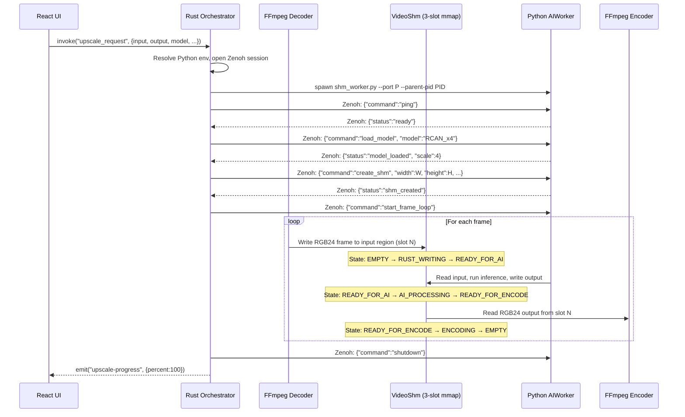
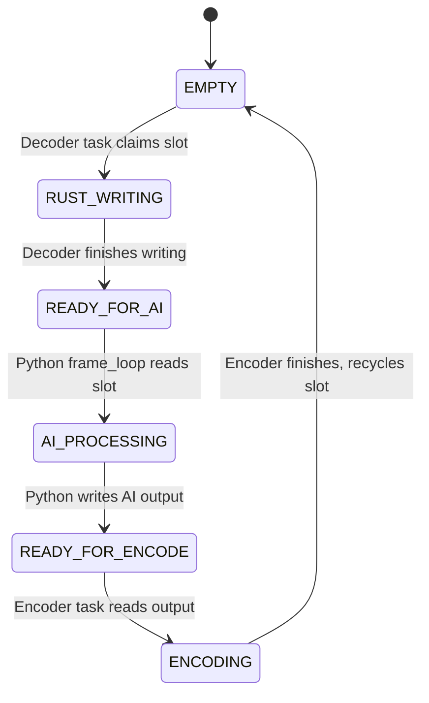
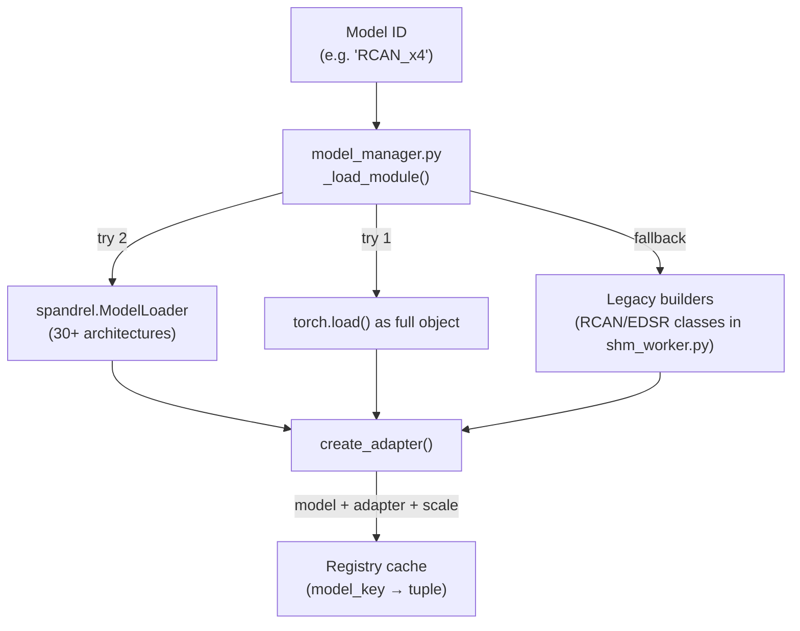

# VideoForge Data Flow

## Primary Pipeline: Video AI Upscale (`upscale_request`)

This is the core production path. Data flows through three concurrent stages connected by a shared memory ring buffer.



### Shared Memory Layout

```
Offset 0:                    Slot Headers (ring_size × 16 bytes)
┌──────────────────────────────────────────────────┐
│ Slot 0: [state:u32][reserved:u32][reserved:u64]  │
│ Slot 1: [state:u32][reserved:u32][reserved:u64]  │
│ Slot 2: [state:u32][reserved:u32][reserved:u64]  │
└──────────────────────────────────────────────────┘

Offset 48:                   Slot 0 Data
┌──────────────────────────────────────────────────┐
│ Input:  W × H × 3 bytes (RGB24)                  │
│ Output: (W×scale) × (H×scale) × 3 bytes (RGB24)  │
└──────────────────────────────────────────────────┘
                             Slot 1 Data...
                             Slot 2 Data...
```

### State Machine (per slot)



### Concurrency Model

Three tokio tasks run simultaneously, coordinated by MPSC channels (`free_tx`/`pending_tx`/`enc_tx`):

| Task | Role | Input | Output |
|------|------|-------|--------|
| **Decoder** | Reads FFmpeg stdout → SHM input | `free_rx` (available slot indices) | `pending_tx` (slot with frame) |
| **Poller** | Monitors SHM states, pushes research params | `pending_rx` (slot being processed) | `enc_tx` (slot ready for encode) |
| **Encoder** | Reads SHM output → FFmpeg stdin | `enc_rx` (completed slot) | `free_tx` (recycled slot) |

---

## Secondary Pipeline: Export Without AI (`export_request`)

A simpler path that uses FFmpeg directly for transcoding with geometry/color edits.

```
Input File → ffmpeg -i input [filters] -c:v h264_nvenc output.mp4
```

Filters are built by `FilterChainBuilder` from `EditConfig`:

- Trim: `-ss` / `-to` arguments
- Crop: `crop=w:h:x:y`
- Rotation: `transpose=1/2/3`
- Color: `eq=brightness=B:contrast=C:saturation=S:gamma=G`

---

## Image Upscale Path

For single images, no SHM is used. Instead:

```
Rust → Zenoh: {"command":"upscale_image_file", "input_path":..., "output_path":..., "edit_config":...}
Python: loads image → applies edits → runs inference → saves result
Python → Zenoh: {"status":"progress", "percent":50}
Python → Zenoh: {"status":"complete", "output_path":...}
```

---

## Research Parameter Flow

Research parameters enable real-time control of blending, hallucination detection, and temporal stabilization during video processing.

```mermaid
flowchart LR
    UI["UI Sliders<br/>(ResearchNode)"] -->|"invoke()"| TC["Tauri Command<br/>(update_research_param)"]
    TC -->|"Arc Mutex"| RC["ResearchConfig<br/>(in-memory)"]
    RC -->|"Zenoh pub<br/>(vf/control/**)"|  PY["Python AIWorker"]
    PY --> RL["ResearchLayer<br/>(research_layer.py)"]
    PY --> BL["PredictionBlender<br/>(blender_engine.py)"]
```

Parameters include:

- **Blend alpha** (structure/texture/perceptual/diffusion weights)
- **HF method** (laplacian/sobel/highpass/fft)
- **Hallucination sensitivity**
- **Temporal strength** (EMA alpha for frame smoothing)
- **Edge threshold** / **Texture threshold**

---

## Spatial Map Flow

Hallucination masks are computed by the Python worker and sent back to the UI for visual overlay:

```
Python: _publish_spatial_map(lr_rgb)
  → compute HF energy mask
  → Zenoh pub: "videoforge/research/spatial_map" (binary: [u32:W][u32:H][u8×W×H:mask])

Rust: SpatialMapSubscriber receives → stores in AtomicBool-gated buffer
UI: polls fetch_spatial_frame → renders SpatialMapOverlay with <canvas>
```

---

## Model Loading Flow



Weight file resolution order:

1. `weights/{key}.pth` / `.pt` / `.safetensors`
2. `weights/{key}/{key}.pth`
3. Glob scan of `weights/` directory

---

## engine-v2 Pipeline (Not Yet Integrated)

A fully GPU-resident pipeline with zero host copies:

```
NVDEC (GPU decode) → NV12 buffer (device ptr)
  → CUDA kernel: NV12→RGB planar F32/F16 (NCHW)
  → TensorRT inference via ORT IO Binding
  → CUDA kernel: RGB planar→NV12
  → NVENC (GPU encode)
```

Connected by bounded `tokio::mpsc` channels. Four stages:

1. **Decode** — `NvDecoder.decode_next()` → `FrameEnvelope`
2. **Preprocess** — `PreprocessPipeline.prepare()` → `ModelInput`
3. **Infer** — `TensorRtBackend.process()` → upscaled `GpuTexture`
4. **Encode** — `NvEncoder.encode_frame()` → bitstream packets

Key invariant: `decoded ≥ preprocessed ≥ inferred ≥ encoded` (validated at shutdown).
