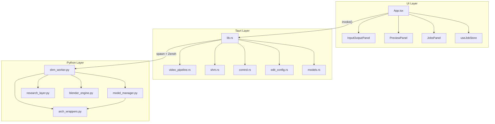

# VideoForge Module Map

## Repository Layout

```
VideoForge1/
├── ui/                          # React frontend (Vite)
│   └── src/
│       ├── App.tsx                   Main application shell + mosaic layout
│       ├── App.css                   Global styles
│       ├── index.tsx                 React entrypoint
│       ├── types.ts                  Shared TypeScript types
│       ├── Store/
│       │   ├── useJobStore.tsx        Zustand store (processing state, upscale config)
│       │   └── viewLayoutStore.ts     Panel visibility state
│       ├── components/
│       │   ├── InputOutputPanel.tsx    File selection, settings, research params
│       │   ├── PreviewPanel.tsx        Video preview + comparison
│       │   ├── JobsPanel.tsx           Job queue management
│       │   ├── LogsPanel.tsx           Activity/log panel
│       │   ├── AIUpscaleNode.tsx       AI model/scale selector
│       │   ├── CropOverlay.tsx         Crop region editor
│       │   ├── SpatialMapOverlay.tsx   Hallucination mask overlay
│       │   ├── VideoPlayer.tsx         Video playback component
│       │   ├── VideoEngine.tsx         Engine install UI
│       │   ├── Timeline.tsx            Trim timeline
│       │   ├── StatusFooter.tsx        Bottom status bar
│       │   ├── TitleBar.tsx            Custom window title bar
│       │   ├── ToggleGroup.tsx         Reusable toggle control
│       │   ├── PanelHeader.tsx         Panel header with close button
│       │   ├── ProgressBar.tsx         Progress indicator
│       │   ├── SignalSummary.tsx        Signal quality summary
│       │   ├── EmptyState.tsx          Empty state placeholder
│       │   └── ViewMenu.tsx            Panel visibility menu
│       ├── hooks/
│       │   └── useTauriEvents.ts       Tauri event listener hook
│       └── utils/
│           └── modelClassification.ts  Model family detection
│
├── src-tauri/                   # Rust backend (Tauri)
│   ├── src/
│   │   ├── lib.rs                    Tauri commands + main orchestration
│   │   ├── main.rs                   Binary entrypoint (calls lib::run())
│   │   ├── video_pipeline.rs         FFmpeg decoder/encoder abstractions
│   │   ├── shm.rs                    Shared memory ring buffer (VideoShm)
│   │   ├── control.rs                Zenoh control channel + ResearchConfig
│   │   ├── edit_config.rs            Edit parameters + FFmpeg filter builder
│   │   ├── models.rs                 Model discovery (weight file scanning)
│   │   ├── utils.rs                  PNG reading, base64 decode, path gen
│   │   ├── spatial_map.rs            Zenoh subscriber for spatial masks
│   │   └── spatial_publisher.rs      Zenoh publisher for spatial masks
│   ├── Cargo.toml
│   └── tauri.conf.json
│
├── engine-v2/                   # GPU-native engine (standalone)
│   ├── src/
│   │   ├── lib.rs                    Crate root + module declarations
│   │   ├── error.rs                  Typed error hierarchy (EngineError)
│   │   ├── core/
│   │   │   ├── mod.rs
│   │   │   ├── types.rs               GpuTexture, FrameEnvelope, PixelFormat
│   │   │   ├── context.rs             GpuContext, VRAM pool, buffer bucketing
│   │   │   ├── kernels.rs             CUDA preprocessing (NVRTC-compiled)
│   │   │   └── backend.rs             UpscaleBackend trait + ModelMetadata
│   │   ├── backends/
│   │   │   ├── mod.rs
│   │   │   └── tensorrt.rs            TensorRT via ORT, OutputRing, IO Binding
│   │   ├── codecs/
│   │   │   ├── mod.rs
│   │   │   ├── sys.rs                 Raw CUDA/NVENC/NVDEC FFI bindings
│   │   │   ├── nvdec.rs               Hardware decoder (CUVID API)
│   │   │   └── nvenc.rs               Hardware encoder (NVENC API)
│   │   ├── engine/
│   │   │   ├── mod.rs
│   │   │   ├── pipeline.rs            UpscalePipeline (4-stage orchestrator)
│   │   │   └── inference.rs           InferencePipeline (per-frame processing)
│   │   └── debug_alloc.rs            Debug allocation tracker
│   └── Cargo.toml
│
├── python/                      # Python AI sidecar
│   ├── shm_worker.py                Main entry: AIWorker, RCAN/EDSR models, SHM frame loop
│   ├── model_manager.py             Universal model registry + VRAM management
│   ├── arch_wrappers.py             Architecture adapters (BaseAdapter → subclasses)
│   ├── research_layer.py            HF analysis, hallucination detection, spatial blending
│   ├── blender_engine.py            PredictionBlender, temporal EMA, edge masks
│   ├── auto_grade_analysis.py       Auto color grading analysis
│   └── sr_settings_node.py          Research settings node definitions
│
├── weights/                     # Model weight files (.pth, .pt, .safetensors)
├── docs/                        # Documentation
├── CLAUDE.md                    # Project overview for AI assistants
├── package.json                 # Root package (npm scripts)
├── requirements.txt             # Python dependencies
└── run.bat                      # Dev launch script
```

---

## Module Responsibility Matrix

### Rust Backend (`src-tauri/src/`)

| Module | Lines | Responsibility | Key Types |
|--------|-------|---------------|-----------|
| [lib.rs](file:///c:/Users/Calvin/Desktop/VideoForge1/src-tauri/src/lib.rs) | ~1053 | Tauri commands, process management, pipeline orchestration | `ProcessGuard`, `PYTHON_PIDS` |
| [video_pipeline.rs](file:///c:/Users/Calvin/Desktop/VideoForge1/src-tauri/src/video_pipeline.rs) | ~628 | FFmpeg decode/encode, HW accel probing | `VideoDecoder`, `VideoEncoder`, `probe_video` |
| [shm.rs](file:///c:/Users/Calvin/Desktop/VideoForge1/src-tauri/src/shm.rs) | ~220 | Shared memory ring buffer | `VideoShm`, slot state constants |
| [control.rs](file:///c:/Users/Calvin/Desktop/VideoForge1/src-tauri/src/control.rs) | ~550 | Zenoh pub/sub, research params | `ControlChannel`, `ResearchConfig` |
| [edit_config.rs](file:///c:/Users/Calvin/Desktop/VideoForge1/src-tauri/src/edit_config.rs) | ~305 | Video edit parameters, FFmpeg filter chain | `EditConfig`, `FilterChainBuilder` |
| [models.rs](file:///c:/Users/Calvin/Desktop/VideoForge1/src-tauri/src/models.rs) | ~177 | Model weight discovery | `ModelInfo`, `list_models` |
| [utils.rs](file:///c:/Users/Calvin/Desktop/VideoForge1/src-tauri/src/utils.rs) | ~177 | PNG reading, base64, path generation | `read_png_frame`, `generate_unique_path` |
| [spatial_map.rs](file:///c:/Users/Calvin/Desktop/VideoForge1/src-tauri/src/spatial_map.rs) | ~160 | Spatial map subscriber (Zenoh→UI) | `SpatialMapSubscriber` |
| [spatial_publisher.rs](file:///c:/Users/Calvin/Desktop/VideoForge1/src-tauri/src/spatial_publisher.rs) | ~136 | Spatial map publisher (Rust→Zenoh) | `SpatialMapPublisher` |

### engine-v2 (`engine-v2/src/`)

| Module | Lines | Responsibility | Key Types |
|--------|-------|---------------|-----------|
| [pipeline.rs](file:///c:/Users/Calvin/Desktop/VideoForge1/engine-v2/src/engine/pipeline.rs) | ~1170 | 4-stage GPU pipeline orchestrator | `UpscalePipeline`, `PipelineMetrics`, `PipelineConfig` |
| [context.rs](file:///c:/Users/Calvin/Desktop/VideoForge1/engine-v2/src/core/context.rs) | ~858 | CUDA context, buffer pool, VRAM accounting | `GpuContext`, `VramAccounting` |
| [tensorrt.rs](file:///c:/Users/Calvin/Desktop/VideoForge1/engine-v2/src/backends/tensorrt.rs) | ~828 | TensorRT inference + output ring | `TensorRtBackend`, `OutputRing`, `PrecisionPolicy` |
| [kernels.rs](file:///c:/Users/Calvin/Desktop/VideoForge1/engine-v2/src/core/kernels.rs) | ~868 | CUDA preprocessing kernels (NVRTC) | `PreprocessKernels`, `PreprocessPipeline` |
| [nvdec.rs](file:///c:/Users/Calvin/Desktop/VideoForge1/engine-v2/src/codecs/nvdec.rs) | ~629 | Hardware video decoder | `NvDecoder`, `EventPool`, `BitstreamSource` |
| [nvenc.rs](file:///c:/Users/Calvin/Desktop/VideoForge1/engine-v2/src/codecs/nvenc.rs) | ~515 | Hardware video encoder | `NvEncoder`, `RegistrationCache`, `BitstreamSink` |
| [types.rs](file:///c:/Users/Calvin/Desktop/VideoForge1/engine-v2/src/core/types.rs) | ~216 | GPU frame types | `GpuTexture`, `FrameEnvelope`, `PixelFormat` |
| [backend.rs](file:///c:/Users/Calvin/Desktop/VideoForge1/engine-v2/src/core/backend.rs) | ~106 | Backend trait contract | `UpscaleBackend`, `ModelMetadata` |
| [inference.rs](file:///c:/Users/Calvin/Desktop/VideoForge1/engine-v2/src/engine/inference.rs) | ~165 | Per-frame inference pipeline | `InferencePipeline` |
| [error.rs](file:///c:/Users/Calvin/Desktop/VideoForge1/engine-v2/src/error.rs) | ~128 | Error hierarchy with numeric codes | `EngineError`, `Result` |

### Python Worker (`python/`)

| Module | Lines | Responsibility | Key Types |
|--------|-------|---------------|-----------|
| [shm_worker.py](file:///c:/Users/Calvin/Desktop/VideoForge1/python/shm_worker.py) | ~2292 | Main worker: models, SHM, frame loop, inference | `AIWorker`, `ModelLoader`, `RCAN`, `EDSR` |
| [model_manager.py](file:///c:/Users/Calvin/Desktop/VideoForge1/python/model_manager.py) | ~1185 | Model registry, VRAM control, universal loader | `_load_module`, `_detect_family` |
| [research_layer.py](file:///c:/Users/Calvin/Desktop/VideoForge1/python/research_layer.py) | ~1361 | HF analysis, hallucination detection, blending | `HFAnalyzer`, `HallucinationDetector`, `BlendParameters` |
| [arch_wrappers.py](file:///c:/Users/Calvin/Desktop/VideoForge1/python/arch_wrappers.py) | ~393 | Model adapter pattern | `BaseAdapter`, `TransformerAdapter`, `EDSRRCANAdapter` |
| [blender_engine.py](file:///c:/Users/Calvin/Desktop/VideoForge1/python/blender_engine.py) | ~567 | GPU tensor blending, temporal EMA | `PredictionBlender`, `_apply_temporal` |
| [auto_grade_analysis.py](file:///c:/Users/Calvin/Desktop/VideoForge1/python/auto_grade_analysis.py) | — | Auto color grading | — |

### UI Components (`ui/src/`)

| Component | Responsibility |
|-----------|---------------|
| `App.tsx` | Root shell, mosaic layout, keyboard shortcuts, job dispatch |
| `InputOutputPanel.tsx` | File picker, model selector, edit controls, research params |
| `PreviewPanel.tsx` | A/B comparison, crop overlay, spatial map overlay |
| `JobsPanel.tsx` | Job queue with progress, cancel, dismiss |
| `AIUpscaleNode.tsx` | Model architecture selector, scale factor |
| `useJobStore.tsx` | Zustand store: processing state, upscale config, progress |

---

## Dependency Graph



---

## Coupling Analysis

### Tight Coupling (high change-risk pairs)

| Module A | Module B | Coupling Point |
|----------|----------|---------------|
| `lib.rs` | `shm.rs` | Slot state constants, SHM creation protocol |
| `lib.rs` | `shm_worker.py` | Zenoh message schema (JSON commands/responses) |
| `shm.rs` | `shm_worker.py` | Shared memory layout (header size, slot offsets, state values) |
| `control.rs` | `shm_worker.py` | Research parameter key names and value types |
| `video_pipeline.rs` | `lib.rs` | FFmpeg argument construction, HWACCEL probing |
| `useJobStore.tsx` | `App.tsx` | `UpscaleConfig` shape, `setUpscaleConfig` merge-patch |

### Loose Coupling (well-defined interfaces)

| Boundary | Interface |
|----------|-----------|
| UI → Rust | Tauri `invoke()` with typed args/return |
| Rust → Python | Zenoh pub/sub with JSON messages |
| Model loading | `BaseAdapter` + `spandrel` auto-detection |
| engine-v2 stages | `FrameDecoder` / `UpscaleBackend` / `FrameEncoder` traits |
