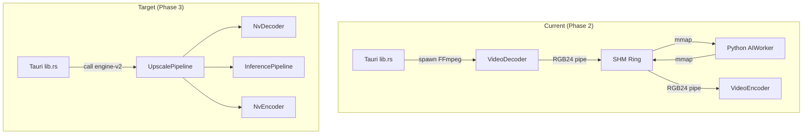

# VideoForge Refactoring & Migration Plan

## Strategic Goal

Migrate from the current **CPU-mediated SHM pipeline** to the **GPU-native engine-v2 pipeline**, eliminating all host-side frame copies and achieving 5-10× throughput improvement.

---

## Phase 1: Debt Reduction & Seam Hardening

*Goal: Clean up the production pipeline, making it safer and easier to wrap with engine-v2.*

### 1.1 Extract Zenoh Protocol Schema

**Problem**: The Zenoh JSON message format is implicitly shared between `lib.rs` and `shm_worker.py` with no formal schema. Adding a field requires coordinated changes in both codebases.

**Action**:

- Define a `protocol.json` or Rust enum + Python dataclass mirroring all command/response types.
- Add version field to handshake for forward compatibility.

**Files affected**: [lib.rs](file:///c:/Users/Calvin/Desktop/VideoForge1/src-tauri/src/lib.rs), [shm_worker.py](file:///c:/Users/Calvin/Desktop/VideoForge1/python/shm_worker.py)

### 1.2 Extract SHM Constants to Shared Header

**Problem**: Slot state values (`SLOT_EMPTY=0`, `SLOT_RUST_WRITING=1`, etc.), header layout, and slot offset calculations are duplicated in `shm.rs` and `shm_worker.py`.

**Action**:

- Create a `shm_protocol.toml` or generate constants for both languages from a single source.
- Add a magic number + version field to the SHM header for layout validation.

**Files affected**: [shm.rs](file:///c:/Users/Calvin/Desktop/VideoForge1/src-tauri/src/shm.rs), [shm_worker.py](file:///c:/Users/Calvin/Desktop/VideoForge1/python/shm_worker.py)

### 1.3 Consolidate Model Loading

**Problem**: Model loading logic exists in three places:

1. `ModelLoader` class in `shm_worker.py` (RCAN/EDSR/RealESRGAN builders)
2. `_load_module()` in `model_manager.py` (spandrel + fallback)
3. `_register_official_model_stubs()` in `model_manager.py` (pickle compatibility)

**Action**:

- Merge `ModelLoader` completely into `model_manager.py`.
- Remove RCAN/EDSR class definitions from `shm_worker.py` — use spandrel or `model_manager` exclusively.

**Files affected**: [shm_worker.py](file:///c:/Users/Calvin/Desktop/VideoForge1/python/shm_worker.py) (~300 lines of model code), [model_manager.py](file:///c:/Users/Calvin/Desktop/VideoForge1/python/model_manager.py)

### 1.4 Windows-Only Hardcoding

**Problem**: Multiple Windows-specific assumptions:

- `taskkill /F /PID` in `reset_engine`
- `CREATE_NO_WINDOW` flag (`0x08000000`)
- Windows SHM paths (`mmap.mmap(-1, ...)` with tagname)
- `ctypes.windll.kernel32.OpenProcess` in watchdog

**Action**: Gate behind `#[cfg(target_os)]` / `sys.platform` checks, add Linux/macOS stubs. This is not blocking for v1 but prevents cross-platform expansion.

---

## Phase 2: Production Pipeline Optimization

*Goal: Extract maximum performance from the current architecture before the engine-v2 migration.*

### 2.1 Pre-allocated CUDA Tensors

Replace per-frame tensor allocation in `_process_slot`:

```diff
- img_tensor = torch.from_numpy(img_np).permute(2, 0, 1).unsqueeze(0).float().div_(255.0).to(device)
+ # Pre-allocated in create_shm:
+ self._input_tensor[:] = torch.from_numpy(img_np).permute(2, 0, 1).unsqueeze(0).float().div_(255.0)
```

**Impact**: Eliminates ~1-2 ms CUDA malloc per frame.

### 2.2 Cross-Process Synchronization

Replace `time.sleep(0.0005)` polling with named Win32 events or semaphores:

- Rust signals `SlotReady` semaphore after writing input
- Python waits on semaphore instead of polling
- Python signals `SlotDone` after writing output
- Rust poller waits instead of polling

**Impact**: Reduces idle CPU waste, improves latency by ~0.5ms per frame.

### 2.3 Increase Ring Buffer from 3 to 6 Slots

More slots allow better pipelining overlap. The decoder can write several frames ahead while the AI processes earlier ones.

### 2.4 TensorRT Model Export

Create an ONNX export path for the production models:

```python
torch.onnx.export(model, dummy_input, "model.onnx", opset_version=17)
```

Then use ORT with TensorRT EP (already available in engine-v2's `tensorrt.rs` patterns).

---

## Phase 3: engine-v2 Integration

*Goal: Replace the FFmpeg+SHM+Python pipeline with the GPU-native engine-v2.*

### 3.1 Integration Architecture



### 3.2 Migration Steps

| Step | Action | Risk |
|------|--------|------|
| 3.2.1 | Add `engine-v2` as a dependency in `src-tauri/Cargo.toml` | Low — it's already in the workspace |
| 3.2.2 | Create `NativeUpscaleCommand` Tauri command alongside `upscale_request` | Low — additive, no breaking changes |
| 3.2.3 | Implement `BitstreamSource` for file reading (FFmpeg demuxer or direct) | Medium — needs H.264/HEVC demux |
| 3.2.4 | Implement `BitstreamSink` for file writing (MP4 muxer) | Medium — container format handling |
| 3.2.5 | Wire ONNX model loading into `TensorRtBackend` | Low — backend already supports this |
| 3.2.6 | Add UI toggle for "Native Engine" vs "Python Engine" | Low — UI change only |
| 3.2.7 | Feature-flag the Python pipeline for gradual rollout | Low — `#[cfg(feature)]` |
| 3.2.8 | Remove Python pipeline when native is stable | Medium — ensure parity |

### 3.3 Research Layer Migration

The research layer (hallucination detection, prediction blending, temporal stabilization) currently lives in Python. Two options:

| Option | Pros | Cons |
|--------|------|------|
| **A. Keep Python for research** | No rewrite, rapid iteration | Breaks zero-copy, needs SHM bridge |
| **B. Port to CUDA kernels** | Full GPU residency, maximum perf | Significant dev effort, loses PyTorch flexibility |
| **C. Hybrid: ONNX export** | Keeps model portability | Research layer isn't a standard model |

**Recommendation**: Option A initially (research is optional/experimental), with Option B as a stretch goal for the blending kernels that are already GPU-only (see `blender_engine.py`).

---

## Phase 4: Code Quality & Maintainability

### 4.1 `lib.rs` Decomposition

At ~1053 lines, `lib.rs` handles too many concerns. Proposed split:

| New Module | Extracted From | Lines |
|-----------|---------------|-------|
| `commands/upscale.rs` | `upscale_request` + helpers | ~500 |
| `commands/export.rs` | `export_request` | ~100 |
| `commands/engine.rs` | `install_engine`, `check_engine_status` | ~100 |
| `python_env.rs` | `resolve_python_env`, `ProcessGuard`, `PYTHON_PIDS` | ~100 |
| `lib.rs` (residual) | `run()`, Tauri app builder, state setup | ~150 |

### 4.2 Error Handling Standardization

Currently mixed:

- `lib.rs`: `anyhow::Result` with `.map_err(|e| e.to_string())`
- `engine-v2`: Typed `EngineError` with error codes
- Python: bare `try/except` with `print()` logging

**Action**: Adopt the engine-v2 error pattern throughout. Return structured error types from Tauri commands instead of `.to_string()`.

### 4.3 Logging Standardization

- Rust backend uses `println!` and `eprintln!`
- engine-v2 uses `tracing` with structured fields
- Python uses `print()`

**Action**: Migrate all Rust code to `tracing`. Migrate Python to `logging` module. Add structured fields for correlation (frame_index, job_id, slot_index).

---

## Risk Assessment

| Risk | Severity | Mitigation |
|------|----------|------------|
| engine-v2 codec gaps (no audio, limited containers) | High | Use FFmpeg for muxing/demuxing, engine-v2 for video stream only |
| TensorRT model compatibility (not all PyTorch ops supported) | Medium | Test each model arch; fall back to Python for unsupported |
| Research layer feature parity | Medium | Keep Python pipeline as fallback for research workflows |
| Windows-only NVDEC/NVENC API | Low | Already Windows-only in production |
| Memory cliff (VRAM exhaustion on consumer GPUs) | Medium | engine-v2 has `set_vram_limit` advisory cap; add OOM fallback |

---

## Priority Order

```
┌──────────────────────────────────────────────────┐
│ Phase 1: Debt Reduction (1-2 weeks)              │
│   1.1 Protocol schema                            │
│   1.3 Model loading consolidation                │
│   4.1 lib.rs decomposition                       │
├──────────────────────────────────────────────────┤
│ Phase 2: Pipeline Optimization (1-2 weeks)       │
│   2.1 Pre-allocated tensors                      │
│   2.2 Cross-process sync                         │
│   2.3 Ring buffer expansion                      │
├──────────────────────────────────────────────────┤
│ Phase 3: engine-v2 Integration (3-6 weeks)       │
│   3.2.1-3.2.4 Core integration                   │
│   3.2.5-3.2.6 Model + UI hookup                  │
│   3.2.7-3.2.8 Rollout + deprecation              │
├──────────────────────────────────────────────────┤
│ Phase 4: Quality (ongoing)                       │
│   4.2 Error handling                              │
│   4.3 Logging                                     │
└──────────────────────────────────────────────────┘
```
