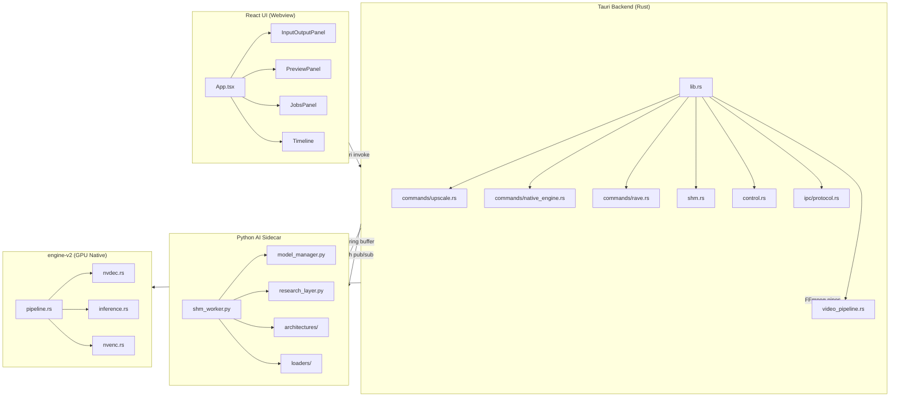
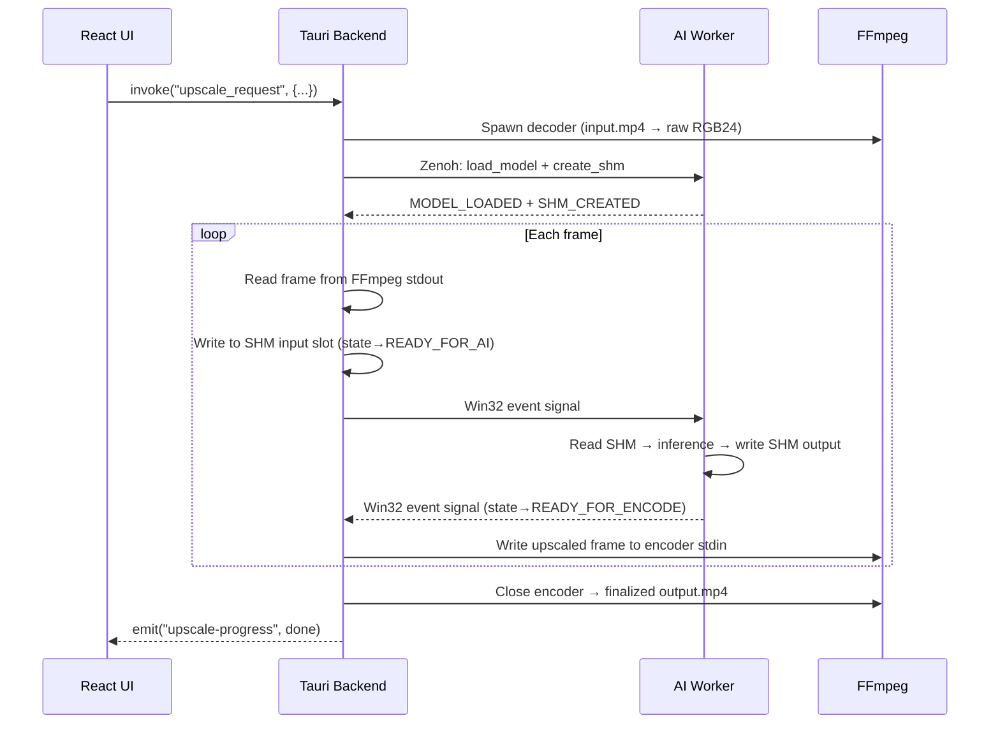
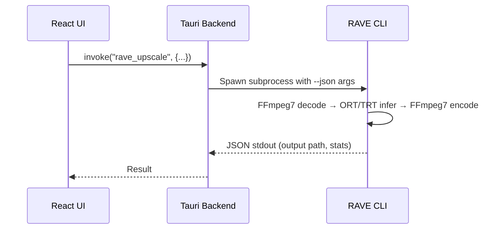

# VideoForge — Comprehensive Codebase Reference

> Post-refactor audit snapshot. Generated 2026-02-26.

---

## Table of Contents

1. [Architecture Overview](#1-architecture-overview)
2. [Repository Layout](#2-repository-layout)
3. [Rust Backend (`src-tauri/`)](#3-rust-backend)
4. [Python AI Sidecar (`python/`)](#4-python-ai-sidecar)
5. [React UI (`ui/`)](#5-react-ui)
6. [Native GPU Engine (`engine-v2/`)](#6-native-gpu-engine)
7. [RAVE CLI (`third_party/rave/`)](#7-rave-cli)
8. [IPC Protocol](#8-ipc-protocol)
9. [Shared Memory (SHM) Protocol](#9-shared-memory-protocol)
10. [CI/CD Pipeline](#10-cicd-pipeline)
11. [Data Flow](#11-data-flow)
12. [Key Design Decisions](#12-key-design-decisions)
13. [File Size Inventory](#13-file-size-inventory)

---

## 1. Architecture Overview

VideoForge is a **desktop AI video upscaler** built with three cooperating runtime layers:



**Three upscale paths:**

| Path | Transport | GPU Usage | Status |
|------|-----------|-----------|--------|
| **Python SHM** | Zenoh IPC + SHM ring buffer | PyTorch (CUDA) | ✅ Production |
| **RAVE CLI** | Subprocess + FFmpeg7 DLLs | ORT + TensorRT/CUDA | ✅ Production |
| **Native Engine** | In-process FFI | NVDEC→TensorRT→NVENC | 🔧 Feature-gated |

---

## 2. Repository Layout

```
VideoForge1/
├── src-tauri/              # Rust backend (Tauri app)
│   ├── src/
│   │   ├── bin/smoke.rs    # E2E smoke test binary (1119 lines)
│   │   ├── commands/       # Tauri command handlers
│   │   ├── ipc/            # Zenoh IPC protocol
│   │   ├── lib.rs          # Entry point, module wiring
│   │   ├── shm.rs          # Shared memory ring buffer (1269 lines)
│   │   ├── control.rs      # Research config Zenoh bridge
│   │   └── video_pipeline.rs # FFmpeg decode/encode wrappers
│   ├── Cargo.toml
│   └── tauri.conf.json
├── python/                 # Python AI sidecar
│   ├── shm_worker.py       # Main worker loop (1968 lines)
│   ├── model_manager.py    # Model loading/management (1672 lines)
│   ├── research_layer.py   # Multi-model research blending (1428 lines)
│   ├── architectures/      # SR model definitions (RCAN, EDSR, RealESRGAN)
│   ├── loaders/            # Model loader modules (Spandrel, Swin2SR, ONNX)
│   ├── watchdog.py         # Parent PID monitoring
│   ├── event_sync.py       # Win32 named-event sync
│   └── shm_ring.py         # SHM ring buffer management
├── ui/                     # React frontend
│   └── src/
│       ├── App.tsx          # Main app (945 lines)
│       ├── components/      # 18 components + panel/
│       ├── Store/           # Zustand stores
│       ├── hooks/           # Custom React hooks
│       └── utils/           # Model classification utils
├── engine-v2/              # Native GPU engine crate
│   └── src/                # NVDEC→TensorRT→NVENC pipeline
├── third_party/
│   ├── rave/               # RAVE CLI binary + runtime DLLs
│   ├── ffmpeg/             # FFmpeg 6.x binaries
│   ├── ffmpeg7/            # FFmpeg 7.x binaries (for RAVE)
│   └── nvcodec/            # NVIDIA Video Codec SDK headers
├── tools/
│   ├── ci/                 # CI validation scripts (8 PowerShell)
│   ├── bench/              # Benchmark tooling
│   └── export_onnx.py      # PyTorch → ONNX converter
├── ipc/                    # IPC protocol schemas
│   ├── protocol.schema.json # Zenoh message contract
│   └── shm_protocol.json   # SHM layout constants
└── SMOKE_TEST.md           # Smoke test runbook
```

---

## 3. Rust Backend

### Module Map

| File | Lines | Purpose |
|------|-------|---------|
| [lib.rs](file:///C:/Users/Calvin/Desktop/VideoForge1/src-tauri/src/lib.rs) | 143 | Entry point, module declarations, system monitor, Tauri wiring |
| [commands/upscale.rs](file:///C:/Users/Calvin/Desktop/VideoForge1/src-tauri/src/commands/upscale.rs) | — | Python-path upscale orchestrator |
| [commands/native_engine.rs](file:///C:/Users/Calvin/Desktop/VideoForge1/src-tauri/src/commands/native_engine.rs) | 585 | `native_engine` feature-gated GPU pipeline |
| [commands/rave.rs](file:///C:/Users/Calvin/Desktop/VideoForge1/src-tauri/src/commands/rave.rs) | — | RAVE CLI subprocess integration |
| [commands/export.rs](file:///C:/Users/Calvin/Desktop/VideoForge1/src-tauri/src/commands/export.rs) | — | Transcode-only export |
| [commands/engine.rs](file:///C:/Users/Calvin/Desktop/VideoForge1/src-tauri/src/commands/engine.rs) | — | Engine status, model discovery, OS helpers |
| [shm.rs](file:///C:/Users/Calvin/Desktop/VideoForge1/src-tauri/src/shm.rs) | 1269 | `VideoShm` — memory-mapped ring buffer with atomic slot states |
| [video_pipeline.rs](file:///C:/Users/Calvin/Desktop/VideoForge1/src-tauri/src/video_pipeline.rs) | 632 | `VideoDecoder`/`VideoEncoder` — FFmpeg subprocess management |
| [control.rs](file:///C:/Users/Calvin/Desktop/VideoForge1/src-tauri/src/control.rs) | 556 | `ControlChannel` — real-time research param Zenoh bridge |
| [ipc/protocol.rs](file:///C:/Users/Calvin/Desktop/VideoForge1/src-tauri/src/ipc/protocol.rs) | — | `RequestEnvelope`/`ResponseEnvelope` serialization |
| [python_env.rs](file:///C:/Users/Calvin/Desktop/VideoForge1/src-tauri/src/python_env.rs) | — | Python environment resolution, `ProcessGuard` |
| [models.rs](file:///C:/Users/Calvin/Desktop/VideoForge1/src-tauri/src/models.rs) | — | Model info types, weight file discovery |
| [edit_config.rs](file:///C:/Users/Calvin/Desktop/VideoForge1/src-tauri/src/edit_config.rs) | — | Crop, rotate, flip, color edit configuration |
| [spatial_map.rs](file:///C:/Users/Calvin/Desktop/VideoForge1/src-tauri/src/spatial_map.rs) | — | Per-frame spatial analysis state |
| [spatial_publisher.rs](file:///C:/Users/Calvin/Desktop/VideoForge1/src-tauri/src/spatial_publisher.rs) | — | Spatial map Zenoh publisher |
| [win_events.rs](file:///C:/Users/Calvin/Desktop/VideoForge1/src-tauri/src/win_events.rs) | — | Win32 named event creation/signaling |
| [run_manifest.rs](file:///C:/Users/Calvin/Desktop/VideoForge1/src-tauri/src/run_manifest.rs) | — | Run artifact/manifest persistence |
| [rave_cli.rs](file:///C:/Users/Calvin/Desktop/VideoForge1/src-tauri/src/rave_cli.rs) | — | RAVE CLI argument building and invocation |
| [bin/smoke.rs](file:///C:/Users/Calvin/Desktop/VideoForge1/src-tauri/src/bin/smoke.rs) | 1119 | Standalone E2E smoke test binary |

### Key Tauri Commands (registered in `lib.rs`)

```
upscale_request              # Python-path video upscale
upscale_request_native       # Native engine upscale (feature-gated)
rave_environment / rave_validate / rave_upscale / rave_benchmark
export_request               # Transcode-only export
check_engine_status / install_engine / reset_engine / get_models
get_research_config / set_research_config / update_research_param
fetch_spatial_frame / mark_frame_complete
show_in_folder / open_media
```

---

## 4. Python AI Sidecar

### Module Map

| File | Lines | Purpose |
|------|-------|---------|
| [shm_worker.py](file:///C:/Users/Calvin/Desktop/VideoForge1/python/shm_worker.py) | 1968 | `AIWorker` — main loop, inference, SHM frame processing |
| [model_manager.py](file:///C:/Users/Calvin/Desktop/VideoForge1/python/model_manager.py) | 1672 | `ModelLoader` — model discovery, loading, staged safe-loading |
| [research_layer.py](file:///C:/Users/Calvin/Desktop/VideoForge1/python/research_layer.py) | 1428 | `VideoForgeResearchLayer` — multi-model blending, spatial routing |
| [arch_wrappers.py](file:///C:/Users/Calvin/Desktop/VideoForge1/python/arch_wrappers.py) | — | Architecture adapter wrappers |
| [sr_settings_node.py](file:///C:/Users/Calvin/Desktop/VideoForge1/python/sr_settings_node.py) | — | SR pipeline settings node |
| [auto_grade_analysis.py](file:///C:/Users/Calvin/Desktop/VideoForge1/python/auto_grade_analysis.py) | — | Automated quality grading |
| [blender_engine.py](file:///C:/Users/Calvin/Desktop/VideoForge1/python/blender_engine.py) | — | Multi-model frame blending engine |
| [ipc_protocol.py](file:///C:/Users/Calvin/Desktop/VideoForge1/python/ipc_protocol.py) | — | Zenoh message serialization (Python side) |
| [logging_setup.py](file:///C:/Users/Calvin/Desktop/VideoForge1/python/logging_setup.py) | — | Structured logging configuration |

### Extracted Modules (Post-Refactor)

| Module | Source | Purpose |
|--------|--------|---------|
| [watchdog.py](file:///C:/Users/Calvin/Desktop/VideoForge1/python/watchdog.py) | `shm_worker.py` | PID monitoring, orphan process prevention |
| [event_sync.py](file:///C:/Users/Calvin/Desktop/VideoForge1/python/event_sync.py) | `shm_worker.py` | `EventSync` — Win32 named-event low-latency IPC |
| [shm_ring.py](file:///C:/Users/Calvin/Desktop/VideoForge1/python/shm_ring.py) | `shm_worker.py` | `ShmRingBuffer` — ring buffer slot management |

### Subpackages

**`architectures/`** — SR model class definitions:

| File | Exports |
|------|---------|
| [rcan.py](file:///C:/Users/Calvin/Desktop/VideoForge1/python/architectures/rcan.py) | `RCAN`, `RCAB`, `ChannelAttention`, `build_rcan()` |
| [edsr.py](file:///C:/Users/Calvin/Desktop/VideoForge1/python/architectures/edsr.py) | `EDSR`, `EDSRResBlock`, `remap_edsr_keys()`, `build_edsr()` |
| [realesrgan.py](file:///C:/Users/Calvin/Desktop/VideoForge1/python/architectures/realesrgan.py) | `build_realesrgan()` |

**`loaders/`** — Third-party model loaders (lazy imports):

| File | Exports | Dependencies |
|------|---------|-------------|
| [spandrel_loader.py](file:///C:/Users/Calvin/Desktop/VideoForge1/python/loaders/spandrel_loader.py) | `load_via_spandrel()` | `spandrel` |
| [swin2sr_loader.py](file:///C:/Users/Calvin/Desktop/VideoForge1/python/loaders/swin2sr_loader.py) | `Swin2SRWrapper`, `load_swin2sr_hf()` | `transformers` |
| [onnx_loader.py](file:///C:/Users/Calvin/Desktop/VideoForge1/python/loaders/onnx_loader.py) | `OnnxModelWrapper`, `load_onnx_model()` | `onnxruntime` |
| [official_stubs.py](file:///C:/Users/Calvin/Desktop/VideoForge1/python/loaders/official_stubs.py) | `register_official_model_stubs()` | `torch` |

### Security

`model_manager.py` uses **staged safe-loading** for `torch.load`:

1. First tries `weights_only=True` (no pickle execution)
2. Falls back to `weights_only=False` **only if** `ALLOW_UNSAFE_LOAD=True`
3. Logs `SECURITY WARNING` on fallback

---

## 5. React UI

### Component Map

| Component | Lines | Purpose |
|-----------|-------|---------|
| [App.tsx](file:///C:/Users/Calvin/Desktop/VideoForge1/ui/src/App.tsx) | 945 | Root — layout (react-mosaic), state, upscale orchestration |
| [InputOutputPanel.tsx](file:///C:/Users/Calvin/Desktop/VideoForge1/ui/src/components/InputOutputPanel.tsx) | 1701 | Settings panel — model selection, I/O paths, research config |
| [AIUpscaleNode.tsx](file:///C:/Users/Calvin/Desktop/VideoForge1/ui/src/components/AIUpscaleNode.tsx) | 1036 | AI upscale node with model management |
| [PreviewPanel.tsx](file:///C:/Users/Calvin/Desktop/VideoForge1/ui/src/components/PreviewPanel.tsx) | 767 | Video preview with before/after comparison |
| [Timeline.tsx](file:///C:/Users/Calvin/Desktop/VideoForge1/ui/src/components/Timeline.tsx) | 756 | Frame-accurate timeline with trim controls |
| [JobsPanel.tsx](file:///C:/Users/Calvin/Desktop/VideoForge1/ui/src/components/JobsPanel.tsx) | 504 | Job queue management |
| [LogsPanel.tsx](file:///C:/Users/Calvin/Desktop/VideoForge1/ui/src/components/LogsPanel.tsx) | 329 | Real-time job logs |
| [ViewMenu.tsx](file:///C:/Users/Calvin/Desktop/VideoForge1/ui/src/components/ViewMenu.tsx) | 310 | Panel visibility toggles |
| [ToggleGroup.tsx](file:///C:/Users/Calvin/Desktop/VideoForge1/ui/src/components/ToggleGroup.tsx) | 331 | Segmented controls + crop tool |
| [StatusFooter.tsx](file:///C:/Users/Calvin/Desktop/VideoForge1/ui/src/components/StatusFooter.tsx) | 256 | System stats footer (CPU/RAM/GPU) |
| [SpatialMapOverlay.tsx](file:///C:/Users/Calvin/Desktop/VideoForge1/ui/src/components/SpatialMapOverlay.tsx) | — | Research spatial analysis overlay |
| [EmptyState.tsx](file:///C:/Users/Calvin/Desktop/VideoForge1/ui/src/components/EmptyState.tsx) | — | Onboarding empty state |
| [CropOverlay.tsx](file:///C:/Users/Calvin/Desktop/VideoForge1/ui/src/components/CropOverlay.tsx) | — | Interactive crop overlay |

### Extracted Panel Components (`panel/`)

| File | Exports |
|------|---------|
| [Icons.tsx](file:///C:/Users/Calvin/Desktop/VideoForge1/ui/src/components/panel/Icons.tsx) | 26 SVG icon components |
| [ResearchConfig.ts](file:///C:/Users/Calvin/Desktop/VideoForge1/ui/src/components/panel/ResearchConfig.ts) | `ResearchConfig`, defaults, presets, `HF_METHODS` |
| [constants.ts](file:///C:/Users/Calvin/Desktop/VideoForge1/ui/src/components/panel/constants.ts) | `truncateModelName`, `ASPECT_RATIOS`, `FPS_OPTIONS`, `getSmartResInfo` |
| [Tooltip.tsx](file:///C:/Users/Calvin/Desktop/VideoForge1/ui/src/components/panel/Tooltip.tsx) | Portal-based tooltip with viewport detection |
| [ToastNotification.tsx](file:///C:/Users/Calvin/Desktop/VideoForge1/ui/src/components/panel/ToastNotification.tsx) | Auto-dismissing slide-in toast |
| [SmartPath.tsx](file:///C:/Users/Calvin/Desktop/VideoForge1/ui/src/components/panel/SmartPath.tsx) | Intelligent path truncation |
| [PipelineNode.tsx](file:///C:/Users/Calvin/Desktop/VideoForge1/ui/src/components/panel/PipelineNode.tsx) | `PipelineNode`, `PipelineConnector`, `Section` |
| [SelectionCard.tsx](file:///C:/Users/Calvin/Desktop/VideoForge1/ui/src/components/panel/SelectionCard.tsx) | Card-style selection button |
| [ToggleGroup.tsx](file:///C:/Users/Calvin/Desktop/VideoForge1/ui/src/components/panel/ToggleGroup.tsx) | Segmented toggle button group |
| [ColorSlider.tsx](file:///C:/Users/Calvin/Desktop/VideoForge1/ui/src/components/panel/ColorSlider.tsx) | Styled range slider with accent colors |
| [index.ts](file:///C:/Users/Calvin/Desktop/VideoForge1/ui/src/components/panel/index.ts) | Barrel re-export |

### State Management

| File | Purpose |
|------|---------|
| [useJobStore.tsx](file:///C:/Users/Calvin/Desktop/VideoForge1/ui/src/Store/useJobStore.tsx) | Zustand store — job queue, scale, model state |
| [viewLayoutStore.ts](file:///C:/Users/Calvin/Desktop/VideoForge1/ui/src/Store/viewLayoutStore.ts) | Panel layout persistence |
| [useTauriEvents.ts](file:///C:/Users/Calvin/Desktop/VideoForge1/ui/src/hooks/useTauriEvents.ts) | Tauri event listener hook |
| [modelClassification.ts](file:///C:/Users/Calvin/Desktop/VideoForge1/ui/src/utils/modelClassification.ts) | Model family/scale extraction (16K bytes) |

---

## 6. Native GPU Engine

**Crate:** `videoforge-engine` v2.0.0 — Zero-copy NVDEC→TensorRT→NVENC pipeline.

```
engine-v2/src/
├── lib.rs              # Crate root
├── error.rs            # Structured error types
├── debug_alloc.rs      # Debug allocator tracking
├── core/
│   ├── mod.rs          # Core module
│   ├── context.rs      # CUDA context management
│   ├── backend.rs      # UpscaleBackend trait
│   ├── kernels.rs      # CUDA kernel wrappers
│   └── types.rs        # Tensor/frame types
├── codecs/
│   ├── mod.rs          # Codec module
│   ├── sys.rs          # Raw NVIDIA SDK FFI bindings
│   ├── nvdec.rs        # NVDEC hardware decoder
│   └── nvenc.rs        # NVENC hardware encoder
├── backends/
│   ├── mod.rs          # Backend module
│   └── tensorrt.rs     # TensorRT inference backend
└── engine/
    ├── mod.rs          # Engine module
    ├── pipeline.rs     # End-to-end pipeline orchestrator
    └── inference.rs    # Inference session management
```

**Dependencies:** `cudarc` (CUDA driver), `ort` 2.0-rc11 (ORT + TensorRT EP), `tokio`, `half`

---

## 7. RAVE CLI

**Rust Accelerated Video Engine** — standalone CLI binary at `third_party/rave/`.

Bundled runtime DLLs:

- `avcodec-62.dll`, `avformat-62.dll`, `avutil-60.dll`, `swscale-9.dll` (FFmpeg 7)
- `onnxruntime_providers_cuda.dll`, `onnxruntime_providers_tensorrt.dll`
- `DirectML.dll`

Commands: `validate`, `upscale`, `benchmark` (all with `--json` output)

---

## 8. IPC Protocol

**Transport:** Zenoh pub/sub over TCP loopback (`tcp/127.0.0.1:{port}`)

**Topics:**

- `videoforge/ipc/{port}/req` — Rust → Python requests
- `videoforge/ipc/{port}/res` — Python → Rust responses
- `videoforge/research/spatial_map` — Spatial analysis data

**Message format:** JSON envelope with `version`, `request_id`, `job_id`, `kind`, `payload`

**Commands:** `load_model`, `create_shm`, `start_frame_loop`, `stop_frame_loop`, `update_research_params`, `upscale_image_file`, `shutdown`

**Error codes:** `MODEL_NOT_FOUND`, `SHM_CREATE_FAILED`, `INFERENCE_FAILED`, `UNKNOWN_COMMAND`, `INTERNAL`

Schema: [protocol.schema.json](file:///C:/Users/Calvin/Desktop/VideoForge1/ipc/protocol.schema.json)

---

## 9. Shared Memory Protocol

**Ring buffer layout** (memory-mapped file):

```
[ Global Header   36 bytes  (magic, version, W, H, scale, ring_size) ]
[ SlotHeader × N  96 bytes  (state, frame_bytes, write_index, ...)   ]
[ Slot 0: input (W×H×3) | output (sW×sH×3) ]
[ Slot 1: input | output ]
[ ...                     ]
```

**Slot states** (atomic u32, cross-process safe):

```
0 EMPTY → 1 RUST_WRITING → 2 READY_FOR_AI → 3 AI_PROCESSING → 4 READY_FOR_ENCODE → 5 ENCODING → 0 EMPTY
```

**Synchronization:** Win32 named events (`event_sync.py` / `win_events.rs`) for low-latency signaling, with polling fallback.

---

## 10. CI/CD Pipeline

**Workflow:** [ci.yml](file:///C:/Users/Calvin/Desktop/VideoForge1/.github/workflows/ci.yml) (169 lines)

### `rust` job (runs on `windows-latest`)

- `cargo fmt --check`
- `cargo test --no-default-features`
- RAVE mock validate (contract check)

### `gpu-rave` job (runs on `[self-hosted, windows, gpu]`)

- Gated by `ENABLE_GPU_CI == '1'`
- `cargo check --features native_engine`
- RAVE validate, benchmark, upscale (all with JSON schema validation)
- Benchmark regression gate (optional via `ENABLE_GPU_THRESHOLD_GATE`)

### CI Scripts (`tools/ci/`)

| Script | Purpose |
|--------|---------|
| `check_rave_json_contract.ps1` | Validates RAVE JSON output against expected schema |
| `check_rave_benchmark_thresholds.ps1` | Compares benchmark results against baseline |
| `calibrate_rave_gpu_baseline.ps1` | Generates benchmark baseline |
| `update_rave_benchmark_baseline.ps1` | Updates stored baseline |
| `check_deps.ps1` | Dependency verification |
| `check_docs.ps1` | Documentation completeness check |
| `run_release_signoff_windows.ps1` | Release signoff automation |

---

## 11. Data Flow

### Python-Path Upscale (Production)



### RAVE Upscale Path



---

## 12. Key Design Decisions

| Decision | Rationale |
|----------|-----------|
| **Zenoh over gRPC** | Lower latency for frame-level IPC; no HTTP overhead |
| **SHM ring buffer** | Zero-copy frame transfer; eliminates serialization |
| **Atomic slot states** | Lock-free cross-process synchronization |
| **Win32 named events** | Sub-millisecond wake-up vs polling |
| **Staged `torch.load`** | Security hardening without breaking legacy models |
| **Lazy loader imports** | Faster Python startup; isolates optional deps |
| **Feature-gated native engine** | Compiles on machines without CUDA SDK |
| **RAVE as separate binary** | Independent release cycle; bundled FFmpeg7 |
| **React-Mosaic layout** | Flexible, dockable panel system |
| **Zustand stores** | Lightweight state management vs Redux |

---

## 13. File Size Inventory

### Largest Files (by bytes)

| File | Bytes | Lines | Layer |
|------|-------|-------|-------|
| `InputOutputPanel.tsx` | 86K | 1,701 | UI |
| `shm_worker.py` | 82K | 1,968 | Python |
| `model_manager.py` | 69K | 1,672 | Python |
| `research_layer.py` | 55K | 1,428 | Python |
| `shm.rs` | 45K | 1,269 | Rust |
| `AIUpscaleNode.tsx` | 44K | 1,036 | UI |
| `App.tsx` | 40K | 945 | UI |
| `smoke.rs` | 38K | 1,119 | Rust |
| `sr_settings_node.py` | 32K | — | Python |
| `PreviewPanel.tsx` | 30K | 767 | UI |
| `Timeline.tsx` | 30K | 756 | UI |
| `blender_engine.py` | 25K | — | Python |
| `auto_grade_analysis.py` | 24K | — | Python |
| `control.rs` | 22K | 556 | Rust |
| `video_pipeline.rs` | 21K | 632 | Rust |
| `JobsPanel.tsx` | 21K | 504 | UI |
| `native_engine.rs` | 20K | 585 | Rust |
| `arch_wrappers.py` | 18K | — | Python |
| `modelClassification.ts` | 17K | — | UI |

### Total Source Lines (approximate)

| Layer | Files | Est. Lines |
|-------|-------|------------|
| Rust backend | 17 | ~6,500 |
| Rust smoke test | 1 | 1,119 |
| Python sidecar | 18 | ~9,500 |
| React UI | 29 | ~8,500 |
| engine-v2 | 17 | ~3,000 |
| **Total** | **82** | **~28,600** |
